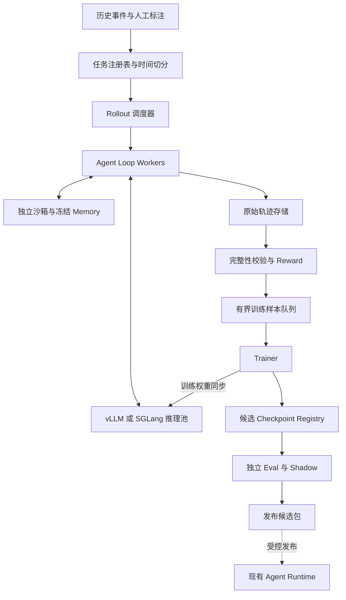

# Tradelife Agent 学习与实施手册

> 合并版 v3.5 · 2026-09-12。本文是项目架构、CMU 课程映射和 RL 系统设计的唯一维护入口。  
> 目标：通过 Tradelife 学习并应用 agent 知识。当前仍为设计文档；新增模块、实验、训练均未实施。  
> 课程及框架资料沿用 2026-09-09 的核对结果；本版根据课程对照审查补齐实验契约，未重新核实课程安排。

文档分工：[README](../README.md) 提供项目与运行入口，[handoff](../handoff.md) 维护实施状态和接手提示；本手册是唯一详细设计。当前明确执行 **F0–F7 / L0–L7**，后续章节不属于本轮实施。

按下面的步骤做，每一步都包含目标、对照实验与完成标准。具体接口和架构设计放在对应步骤下，完成本项目不需要再打开其他项目设计文件。

**当前实施范围：L0–L7。优先阅读 [1.7 L0–L7 框架规格](#framework-l0-l7)，再按对应章节做实验。** 第 9–12 节保留为后续学习资料，不属于当前框架建设范围。本文新增的是设计，不是已经实现的脚手架。

**制作要求：用 coding agent 协助写代码，同时由项目本人掌握设计、关键实现和实验结论，能够在面试中独立解释与答辩。** 具体协作与理解验收见 [1.8 制作与答辩要求](#coding-and-defense)。

| 顺序 | 要做的事 | 本文入口 |
|---|---|---|
| 起点 | 理解现有代码、贯穿任务与目标架构 | [1. 项目与架构](#overview) |
| L0 | 先建立基线和最小评估 | [2. Eval](#l0) |
| L1 | 用 coding agent 协助实现并理解最小工具循环 | [3. Harness](#l1) |
| L2–L3 | 上下文、长短期记忆与 Skills | [4. Context 与 Memory](#memory) |
| L4 | 规划、多 agent 与并发对照 | [5. 多 agent](#l4) |
| L5 | 原生流程与 LangGraph 对照 | [6. 编排](#l5) |
| L6 | 沙箱、对抗输入与可观测性 | [7. 隔离与追踪](#l6) |
| L7 | 人工复核、修正与恢复 | [8. 人机协作](#l7) |
| L8（选做） | Coding、GUI、Research 应用 | [9. 应用实验](#l8) |
| L9 | 监督微调基线 | [10. SFT](#l9) |
| L10 | RL 闭环、rollout、vLLM/SGLang | [11. RL 系统](#l10) |
| L11（选做） | Critic、重排与有限树搜索 | [12. 搜索](#l11) |
| 收尾 | 目录、实验报告与结业项目 | [13. 交付](#delivery) |

**先从 L0 和 L1 开始。** 每次只增加一个主要变量；核心成功标准是理解原理、完成受控实验、用证据解释结果。收益、实盘上线、GPU 数量和组件数量均不作为学习完成条件。

全程以 **Harness → Eval → Training → Research** 四次交付串起来，验收表见[13.5 四阶段交付](#milestones)。L0 只准备样例和最小评分；完整评测体系在 harness 跑通后再完成。前半程新增的重点是[跨环境复用](#harness-reuse)、[2×2 观察消融](#observation-ablation)、[程序化工具调用](#programmatic-tools)、[压缩验收](#compaction-contract)和[Skills 验收](#skills-contract)。


<a id="overview"></a>

## 1. 项目定位、现有代码与目标架构

### 1.1 课程依据

用户给出的来源是 CMU 11-768，2026 年秋季的 AI Agents 课程。已核对公开课程表、作业概览及第一份作业说明。课程表后续可能调整；本路线借用主题，不绑定校历，也不声称已读完所有讲义或未来课程内容。[课程主页](https://www.cmu-agents.com/) · [课程表](https://www.cmu-agents.com/#/schedule)

课程作业按运行框架、评估、训练推进，随后进入研究项目。这适合本项目：先让 agent 能完成一项有限任务，再衡量对错，最后学习如何训练它。[作业概览](https://www.cmu-agents.com/#/assignments)

第一份公开作业要求搭建通用 agent loop，并涉及工具交互、技能加载、上下文压缩及实验比较。Tradelife 可以复用这种学习组织方式，把环境换为频道消息与模拟计划处理；下面的业务任务、数值与验收方式均为本项目自定，不是课程原作业要求。[公开作业说明](https://github.com/cmu-agents/assignment-1/blob/main/ASSIGNMENT.md)

### 1.2 贯穿任务

**任务：理解一条新消息，找到它引用的旧计划，结合当时可见的文字/图片证据，输出可解释的模拟操作。**

贯穿场景（自造教学样例，使用虚拟价格与持仓）：

1. 消息 A 提出 ETH 条件多单，配图含 trigger 与 SL。
2. 消息 B 顺带讨论 BTC，但没有新开仓意图。
3. 消息 C 说“这张多单止损移到成本”。
4. 模拟账户记录一个与 A 对应的已成交 ETH 计划和已知成本。
5. agent 应找到 A，说明 C 是退出保护更新，并在模拟环境中修改对应计划。

变体包括：两个可能的 ETH 计划、缺少成本、图文价格矛盾、已平仓、消息重复、工具超时、摘要遗漏和历史记忆过期。正确结果可能是更新、忽略或复核，由证据决定。

这一条任务自然覆盖 tool use、memory、上下文、规划、多 agent、框架、eval 和 RL；无需给每个术语虚构一个常驻服务。

### 1.3 当前代码基线

当前系统是单进程、事件驱动的交易执行器：

```text
Telegram / replay
      ↓
src.bot / src.main
      ↓
src.parser.parse_message → Signal
      ↓
src.engine.Engine
  ├─ RiskGuard
  ├─ pending plan / breakout confirmation
  ├─ HyperliquidVenue
  └─ SolanaVenue / GMGN
      ↓
data/state.json + logs/tradelife.log
```

已有的关键能力应继续复用：

- `Signal` / `Plan` / `Status` 作为领域对象和状态机基础。
- `RiskGuard` 保留为确定性风控边界；执行网关另行校验权限、幂等与有效期。
- `HyperliquidVenue`、`SolanaVenue` 保持为受控工具适配器。
- `JsonStore` 先作为兼容层，后续再替换为事件日志 + 数据库。
- 纸交易、回放和现有测试继续作为回归基线。

### 1.4 最小学习工程

先保留当前 `src/` 行为作为对照。在未来实现时建立独立实验入口，只注入历史数据、模拟账户与模拟工具。首版只需要一个进程和文件/SQLite；学习 agent loop 不需要先配分布式队列。

```text
任务集 + 时间快照
       ↓
实验配置（模型、预算、seed、开关）
       ↓
Agent Harness
  ├─ Context Builder → 最近交互 / 摘要 / 记忆 / 技能
  ├─ Model Adapter → 决定动作或结束
  └─ Tool Registry → 检索 / 图表 / 模拟计划 / 模拟执行
       ↓
Trajectory + 确定性验收 + 人工检查
       ↓
对照报告 / 下一轮实验 / SFT 与 RL 候选数据
```

学习初期的候选工具：`search_messages`、`get_plan`、`read_chart_levels`、`get_account_snapshot`、`simulate_plan_update`、`submit_decision`。先给工具返回完整状态、错误原因和证据 ID；再实验精简返回字段对决策的影响。

`src/engine.py` 当前把解析、共享状态、风控和 venue 调用放在一起，适合作为业务行为参考，不适合直接复制成多个并发训练环境。学习接口隔离时再逐步提取纯逻辑，避免首个实验变成全仓重构。

### 1.5 可演进的运行架构

```text
Ingress / Replay → 去重与任务记录 → Orchestrator
                                       ├─ Agent loop / LangGraph
                                       │    ↕ Context / Skills / Memory
                                       │    ↕ 只读工具与专业 agent
                                       └─ 内部确定性 workflow
                                                  ↓
                                      结构化 ExecutionPlan
                                                  ↓
                            Schema / RiskGuard / 账户级执行约束
                                                  ↓
                                 Execution Gateway（先模拟）
                                                  ↓
                                状态事件 / 对账 / Trace / Eval

独立训练层：冻结任务与沙箱 → Rollout → Reward → Trainer
                                          ↓
                                  候选模型 → 独立 Eval
```

LLM agent 提出结构化决策，执行网关裁决是否应用；不确定、超时或必要证据缺失时转为跳过或复核。首版从一个进程、少量工具、JSONL trace 和文件/SQLite 开始；分布式队列、向量服务和模型发布系统是后续扩展。

训练层通过版本化任务、轨迹和候选模型连接 runtime，具体设计集中在[第 11 节](#l10)。Coding、GUI 与 Research 可作为独立小实验，无需全部进入常驻消息链。

### 1.6 课程知识点与项目映射

下表左两列概括课程表主题与代码，后两列是 Tradelife 的自定应用映射。课程中的专题讨论、假期和展示不等于需要实现的软件模块。[课程表](https://www.cmu-agents.com/#/schedule)

| 课程编号 | 知识主题 | 项目应用 | 学习实验 |
|---|---|---|---|
| 1a–1b | Agent 基础、工具调用 | Agent Harness + typed tools | L1：循环、错误恢复与终止 |
| 2a | 长上下文管理 | Context Builder | L2：全文/窗口/摘要/检索对照 |
| 2b | 技能与记忆 | Skill Loader、短期状态、长期事实 | L3：跨任务保留与按需加载 |
| 3a | 规划、分解与多 agent 协调 | Planner、角色输出与依赖 | L4：单 agent/多角色对照 |
| 3b | Coding agent | 隔离代码副本上的解析错误修复 | L8-C：补丁与回归结果 |
| 4a | GUI agent | 模拟计划审核页面 | L8-G：受控界面操作 |
| 4b | 监督微调 | ContextResolver 模型训练 | L9：prompt 与 SFT 对照 |
| 5a、6a | RL 基础与进阶算法 | trajectory、reward、策略更新 | L10-A：小任务上的真实参数更新 |
| 5b | Deep Research agent | 某条计划的证据时间线 | L8-R：引用覆盖与矛盾检查 |
| 6b | RL 系统 | rollout 沙箱、推理池、异步与权重同步 | L10-B：吞吐与一致性 |
| 7a | 沙箱与凭证管理 | 工具权限和隔离环境 | L6：越权、注入和状态泄漏样本 |
| 7b、9a | OpenHands、LangGraph | harness/框架边界与可恢复工作流 | L5：原生 Python/LangGraph 对照；OpenHands 用于 L8-C |
| 9b | 可观测性与监控 | trace、失败分类与指标 | L0 起记录，L6 完善 |
| 10a | Agent 与工作 | 任务是否值得自动化的分析 | L7：比较人工耗时与审核成本 |
| 10b | 多 agent 交互 | 协议、交接、冲突与共享状态 | L4：故障、冲突与成本分析 |
| 12a | 人机交互 | evidence card、修正与恢复 | L7：复核收益与负担 |
| 12b、13a | 重排、critic、树搜索 | 候选计划选择与证据检索搜索 | L11：固定预算的搜索对照 |
| 11a–11b、15a–15b | 项目讨论与最终展示 | 实验报告与可复现 demo | Capstone：回答一个研究问题 |

课程表中的客座讲座暂未给出可用于本项目映射的具体主题，待公开内容后再补。上表覆盖能力方向，但不要求按课程日期执行。


<a id="framework-l0-l7"></a>

### 1.7 L0–L7 框架规格：当前阶段的实现依据

继续维护本文件：前文说明项目与课程，下面确定本阶段模块和接口，第 2–8 节说明实验与验收。涉及本阶段的实现选择以本节为准；后面的完整训练架构不作为当前依赖。

#### 1.7.1 范围与默认技术边界

本阶段产物是一个**本地 Agent 实验框架**：同一 harness 支持两个环境，具备可配置上下文与记忆、技能加载、原生/图编排对照、独立 eval、trace、模拟提交与人工复核。

- Python 单进程起步；异步用于模型和只读工具，SQLite 保存运行状态与模拟提交，JSONL 导出轨迹与评分。
- 先接 stub 模型，再通过统一 ModelAdapter 接模型服务；不在本阶段建设 GPU 推理池或 trainer。
- LangGraph 是 L5 的可选 workflow adapter，核心模型/环境/工具契约不依赖它；具体版本在实现时固定。
- 长期记忆先用 SQLite 字段过滤与关键词检索；向量检索留作 L3 可选对照。
- 复核先用 CLI 或本地结构化请求/响应文件，不要求建设 Web UI。复核输入必须经 schema 校验和明确的 submit 操作生效。
- H1/H2/H3 属于 harness 实验：H3 的任意代码执行通过独立 SandboxExecutor；未配置合格沙箱时该工具禁用，不能回退到宿主执行。
- 当前不接实时交易、生产账户或生产状态文件；L8 应用扩展、SFT/RL、分布式调度和模型发布不在本阶段实现。

#### 1.7.2 模块与依赖方向

```text
CLI / ExperimentRunner
  ├─ TaskLoader ── 任务观察包（agent 可见）
  ├─ RunCoordinator ── RunStore / Budget / Trace
  │    └─ WorkflowAdapter（native 或 langgraph）
  │         ├─ AgentHarness ── ModelAdapter
  │         │    ├─ ContextBuilder ── MemoryStore / SkillRegistry
  │         │    └─ ToolDispatcher ── Environment / SandboxExecutor
  │         ├─ EvidenceMerger ── DecisionValidator
  │         └─ ReviewService ── 人工修正后重新验证
  │                                  ↓
  │                       SimulationGateway ── SQLite 事务
  └─ EvalRunner ── 隐藏标签包 + 最终环境快照 + 原始 trace
                    ↓
              CaseScore / 汇总报告
```

依赖只能向领域契约与受控接口收敛：harness 不读取隐藏标签，agent 不直接写 SQLite，workflow 不直接调用 venue，eval 不通过修改运行结果让用例通过。Trace 记录模块事件，不反向决定业务动作。

| 模块 | 负责的内容 | 不负责的内容 | 首次引入 |
|---|---|---|---|
| `domain` | 版本化对象、状态、错误枚举 | 模型/数据库具体实现 | L0 |
| `evals` | 标签、独立 verifier、批量评分与汇总 | 给 agent 答案或训练模型 | L0 起，A2 完善 |
| `runtime` | run 创建、预算、取消、状态持久化与恢复 | 解释具体消息 | L1 |
| `harness` / `models` | 共用工具循环、模型适配 | 风控与事务提交 | L1 |
| `environments` / `tools` | 两套观察/动作适配、工具 schema 与分发 | 隐藏奖励、生产下单 | L1 |
| `context` | 输入预算、摘要与来源装配 | 改写原始 trace | L2 |
| `memory` / `skills` | 检索/更正/过期、元数据发现与按需加载 | 自动增加权限 | L3 |
| `agents` / `workflows` | 角色调用、依赖、汇合、原生与 LangGraph 对照 | 共享可变角色字典 | L4–L5 |
| `execution` | 模拟动作验证、幂等、状态版本与事务 | LLM 推理、真实 venue 调用 | L1 基础，L4–L5 完善 |
| `sandbox` / `observability` | 隔离程序执行、事件、脱敏、计时与故障注入 | 承诺未验证的隔离或吞吐 | 基础随 L1/H3 建立，L6 验收 |
| `interaction` | 证据卡、确认/拒绝/修正、恢复 | 绕过校验直接提交 | L7 |

#### 1.7.3 数据对象：先确定这些边界

以下是拟议字段契约。金额与价格在持久化/比较时使用明确单位的 decimal 字符串；时间统一 UTC，另存事件可见时间。原始 `Signal` / `Plan` 通过显式 mapper 适配，不直接承担所有 agent 运行状态。

| 对象 | 必要字段与语义 |
|---|---|
| `TaskSpec` | `task_id, family_id, split, environment_kind, objective, observation_bundle_id, visible_at, initial_snapshot_id`；不含 gold label |
| `EvalSpec` | `task_id, verifier_version, acceptable_outcomes, evidence_constraints`；仅 EvalRunner 读取 |
| `RunConfig` | `model_version, workflow_backend, context_policy, memory_snapshot_id, skill_versions, tool_schema_version, budgets, seed` |
| `RunState` | `run_id, task_id, status, revision, next_node, active_snapshot_id, last_event_seq, budget_used, decision_version, review_id` |
| `ToolCall/ToolResult` | `call_id, name, arguments` / `status, payload, error_code, retryable, evidence_ids, state_version` |
| `AgentResult` | `role, status, fields, evidence_refs, conflicts, missing_fields, usage`；字段逐项标记来源，不能仅有一段结论 |
| `Decision` | `decision_id, version, kind, referenced_plan_id, proposed_changes, evidence_refs, expected_state_version, expires_at`；kind 为分析提交、模拟更新、忽略或复核 |
| `ReviewRequest` | `review_id, run_id, decision_version, state_version, evidence_card, allowed_response_fields, status, expires_at` |
| `ReviewResponse` | `review_id, expected_revision, decision_version, action, field_patch, reviewer_id`；action 为确认/拒绝/修正 |
| `TraceEvent` | `event_id, run_id, sequence, span_id, parent_span_id, component, kind, timestamp, payload_ref, version_refs` |
| `CaseScore` | `task_id, run_id, completion, protocol_errors, semantic_errors, evidence_score, usage, latency, terminal_reason, verifier_version` |

Budget 按 run 共享：模型调用、输入/输出 token、工具调用、模拟分支、总时限、程序资源上限均有计数。子 agent 启动前预留预算，结束后按实际消耗结算；摘要、重试、程序内部工具调用也计入，避免并发超支。

#### 1.7.4 公共接口（协议草案，不是库 API）

```text
TaskLoader.load(task_id) -> TaskSpec, ObservationBundle
Environment.reset(task, seed) -> Snapshot
Environment.observe(snapshot_id, observation_policy) -> Observation
Environment.simulate(snapshot_id, action) -> SimulationResult
ModelAdapter.generate(ModelRequest) -> ModelTurn, Usage
ContextBuilder.build(run_state, observations, evidence) -> ModelRequest
AgentHarness.run(task, model, tools, context, budget) -> AgentResult
ToolDispatcher.execute(call, run_scope, expected_state_version) -> ToolResult
MemoryStore.retrieve(query, scope, visible_at, snapshot_id) -> MemoryHits
MemoryStore.propose(candidate, provenance) -> CandidateId
SkillRegistry.catalog() / invoke(name, version) -> Metadata / SkillBody
WorkflowAdapter.run_or_resume(run_id, checkpoint) -> WorkflowOutcome
DecisionValidator.validate(decision, snapshot, evidence) -> ValidationResult
SimulationGateway.commit(decision, idempotency_key) -> CommitReceipt
ReviewService.submit(response) -> AcceptedOrStale
EvalRunner.score(task_id, run_id, final_snapshot, trace) -> CaseScore
```

读工具可返回可恢复错误；只有纯读或明确未生效的动作可自动重试。`ModelAdapter` 保留原始响应与调用信息，再标准化工具调用；不能为了格式合法而静默更改模型动作。输出无法解析时记录失败并按预算反馈一次明确错误或结束。

#### 1.7.5 运行状态、模拟提交与崩溃恢复

运行状态与模拟交易状态分开。`SUCCEEDED` 仅表示流程正常终止，任务是否答对由 eval 决定。

```text
CREATED → RUNNING → VALIDATING → COMMITTING → SUCCEEDED
               ↘ WAITING_REVIEW → VALIDATING
               ↘ FAILED / TIMED_OUT / CANCELLED / REJECTED
```

分析环境的 commit 只持久化最终答案；计划环境的 commit 更新模拟账户。需要补证据时从 VALIDATING 回到 RUNNING，受剩余预算和最多补证据轮数约束。纯忽略结果可在验证后完成，不虚构成交。

SQLite 作为本阶段事实来源，至少分开 `runs`、`events`、`snapshots`、`decisions`、`commits`、`reviews`、`memory_records`。使用一个串行写入通道和短事务；模型/HTTP/人工等待发生在事务外。JSONL 是按事件序号导出的副本，恢复不依赖“JSONL 已写完但 DB 未提交”的双写状态。

一次模拟提交在同一事务中完成：检查 decision 版本和有效期 → 校验账户 state version → 重新运行确定性约束 → 应用变更 → 写入新 snapshot、receipt 和提交事件。幂等键为 `run_id + decision_id + decision_version`；同键同 payload 返回原 receipt，同键不同 payload 拒绝。两个不同 run 竞争同一模拟账户时，后提交者因版本冲突重新观察和验证。

恢复时按 `next_node` 和已持久化结果续跑：提交成功但 workflow checkpoint 未落盘时，查询 receipt 并复用结果；不可再应用一次。模型请求已发送但响应未保存时标记为不确定 attempt，重发须记录可能的额外费用，不承诺模型生成 exactly-once。取消 thread 包裹的同步调用可能不会中止底层请求；超时后隔离迟到结果，禁止它触发提交，必要时使用可终止的进程/沙箱。

Native checkpoint 与 LangGraph checkpoint 都只存运行引用、节点结果和 next step，模拟状态仍由 SimulationGateway 管理。跨框架对照使用独立 run 与初始快照，不能让两条 workflow 共同改变一份账户。

#### 1.7.6 上下文、记忆与技能的数据流

输入装配顺序固定为：任务/不可变约束 → 技能目录 → 当次 working memory → 按 scope 与 visible_at 筛选的长期记忆 → 最新完整动作/观察对。每轮保存装配 manifest，记录实际引用事件、摘要版本、技能版本与 token 统计。

长期记忆区分 `active / superseded / expired / deleted`；事实修正新增版本并关联旧记录，检索排除过期/被替代条目。多个冲突来源同时返回并标注，不靠覆盖写入消除分歧。运行中提出的新记忆先放本 run overlay；只有明确的候选审核或规则发布步骤才影响后续任务。

每个实验固定初始 memory snapshot。跨会话记忆实验允许同一已登记任务序列内部演进，但不同实验组从同一初始快照独立复制，且测试标签始终不进入记忆。压缩和 Skills 的完整验收沿用第 4.6–4.7 节。

#### 1.7.7 L4–L5：角色编排的最小实现

不要求七个角色都调用 LLM。首版保留 parser 作为确定性分类基线，ContextResolver 是主要 agent；ChartReader 先返回冻结工具结果，MarketContext 是历史快照工具，风险检查和评分器均为确定性代码。之后逐个把需要推理的模块作为角色实验。

```text
ingest → classify → resolve_context
                     ├─ 有标的/方向 → chart + market 独立读取
                     └─ 无法消歧 → 补证据或复核
         → merge_evidence → propose_decision → validate
         → review（如需要）→ revalidate → commit_simulation → finish
```

并发只对输入已确定的分支开放：若图表读取依赖 ContextResolver 才能确定的标的/方向，就必须等待。各分支写自己独立的 AgentResult，由 EvidenceMerger 统一合并；不让多个 worker 原地更新同一 Signal。合并按字段保留原文/图片/记忆来源，冲突转复核；独立读取失败但不影响必要证据时可继续并标记缺失，否则等待复核或结束。

Native 与 LangGraph adapter 使用相同节点函数、任务、工具、预算、模拟 gateway 和 verifier。先比较顺序等价行为，再测 checkpoint/interrupt/fan-out；L5 仅替换编排表达方式，不同时换模型或角色拓扑。这里不指定未经核对的 LangGraph 方法名。

#### 1.7.8 L6–L7：人工审核与受控恢复

审核卡包含原消息、拟议操作、每个字段的来源、候选计划、冲突/缺失、模拟影响和过期时间。可见操作只有确认、拒绝、修改允许字段；不得修改预算、工具权限或隐藏标签。

`WAITING_REVIEW` 落盘后释放 worker，不占着协程轮询等待人。CLI 提交 response 时校验 review revision、decision version 和状态；重复相同 response 返回既有结果，已处理/过期 response 拒绝。确认或修正均创建/绑定明确 decision 版本，重新读取当前模拟账户再验证。

如果等待期间账户变化，旧确认不能用于新动作：返回 stale，生成新证据卡；修正计划、价格等关键字段后必须重新检查来源与约束。评估分别记录 agent 初始错误率、人工修正后完成率、审核次数与人工耗时，不把人工完成的修复记成模型独立成功。批量测试可用预先定义的模拟 reviewer，但结果标明非真人体验。

#### 1.7.9 Eval 在框架中的具体位置

本阶段目录是 `src/lab/evals/`，独立于 harness 的决策路径，且不依赖未来 `training/rewards/`。TaskLoader 向 agent 只提供 observation bundle；EvalRunner 从单独位置读取 EvalSpec，并根据不可变 trace 与终态评分。

| 评测层 | 输入 | 本阶段必须输出 |
|---|---|---|
| 协议 | 工具调用与结果 | 无效格式、未知工具、权限拒绝、重试与预算错误 |
| 任务 | 目标、证据、最终模拟状态 | 计划/意图/字段正确性、证据支持、目标达成、非目标状态是否被改 |
| 系统 | 事件时序、资源与恢复结果 | 延迟、取消/超时、重复提交、状态泄漏、资源清理 |
| 人机 | 初始 decision、review response、终态 | 自动完成与人工辅助完成分开统计，审核负担与 stale 次数 |

批量 runner 按任务族/时间固定 split，按同一初始快照派生独立 run；保留失败与超时。L0 先做单例 verifier，H2 用于四组观察消融，A2 再扩展批量矩阵。模型判分只作为可选辅助，不替代关键状态的确定性验收。

#### 1.7.10 依赖顺序与本阶段完成定义

| 实施批次 | 对应学习步骤 | 框架交付 | 通过依据 |
|---|---|---|---|
| F0 | L0 | TaskSpec/EvalSpec、冻结样例、单例 verifier | 手写正确/错误输出均能按预期评分，标签未进入输入 |
| F1 | L1/H1 | domain、RunStore、harness、stub、两个环境、工具分发与模拟 gateway | 同一 loop 跑两环境，成功/错误/取消均可追踪；重复提交不重复生效 |
| F2 | L2–L3 | ContextBuilder、模型压缩、SQLite memory、SkillRegistry | 实际压缩与按需加载，跨 run 隔离和事实版本可查 |
| F3 | H2/H3 | 两模型观察矩阵、SandboxExecutor、程序调用展开计数 | 四组报告；多次模拟只提交一次；无合格沙箱则 H3 明确未完成 |
| F4 | L4 | 角色边界、共享预算、只读 fan-out、证据汇合 | 串行/并发同规则评分，冲突与慢分支不会产生非法提交 |
| F5 | L5 | native/langgraph 两套 WorkflowAdapter | 相同输入与 verifier 的对照、提交前后崩溃恢复、无重复副作用 |
| F6 | L6 | 注入/权限/资源/取消故障集和结构化 trace | 每个故障有确定状态、原始证据及资源清理记录 |
| F7 | L7 + A2 | ReviewService、CLI 复核、完整批量评测 | 人工修正后重验、旧审批失效、自动与人工辅助结果分开报告 |

安全与 trace 的基本能力从 F1 开始，F6 做完整故障验收。F0–F7 全部通过后，本阶段完成：已有一个能处理跨消息任务、可比较编排、可复核、可评估的模拟 agent 系统。无需以 RL 训练或实盘部署作为 L7 的出口条件。


<a id="coding-and-defense"></a>

### 1.8 制作与答辩要求：Coding Agent 实现，本人理解与负责

本项目采用 AI 辅助开发。Coding agent 可以编写、修改、测试和解释代码；本人需要理解问题、审阅关键实现、核对实验，并能不依赖 coding agent 回答追问。文中“自己实现 harness”指构建并掌握自己的实现，不要求逐行手工敲代码，也不以背诵源码或 API 参数作为学习标准。

#### 1.8.1 每批代码的协作方式

按 F0–F7 拆成小的可运行增量，每批围绕一个具体行为和验收用例：

1. **实现前明确契约**：coding agent 简述问题、输入输出、调用链、拟改模块与验收；区分当前必须实现和以后扩展，避免一次交付本人无法审阅的大框架。
2. **实现并验证**：coding agent 完成代码与必要检查，提供关键 diff、运行方式、测试结果和已知局限。不能只用生成的测试证明自己正确，至少有按独立行为契约设计的成功/失败样例。
3. **沿一条真实 trace 讲解**：说明从入口到输出经过哪些函数、状态在哪里改变、哪个检查挡住错误。注释解释不显然的约束和取舍，避免给每行代码写重复说明。
4. **本人复述与追问**：本人用自己的话解释流程、一个设计选择及一个替代方案。Coding agent 指出遗漏，不能把它生成的标准答案当作本人已掌握的证据。
5. **做一次小变式**：本人先预测行为，再进行小修改、故障定位或伪代码推演，最后对照结果；例如改变超时、制造重复事件或增加一项约束。

实现可以在已授权范围内持续推进，不要求每个文件都暂停等待确认。交付时分别标记“代码已验证”和“本人理解已验证”；后者没有实际练习就保留待验证。理解薄弱处优先补讲解和小实验，不用继续堆功能掩盖。

#### 1.8.2 每个模块必须留下的理解材料

沿用实验报告位置，每批增加简短“本人理解与答辩”段落，结构如下；不另建一份学习手册：

```text
解决的问题：具体输入与期望行为是什么？
关键路径：入口 → 主要函数/对象 → 状态变化 → 输出。
设计取舍：为什么这样做？替代方案何时更合适？
失败案例：哪种输入或故障会失败？如何定位与恢复？
实验依据：配置、基线、结果、误差与尚未验证的部分。
本人练习：复述 / 预测 / 修改 / 排障的实际记录。
掌握状态：待练习 / 需巩固 / 已通过本次理解检查。
```

关键函数和文件链接应指向届时真实实现；尚未有代码时不编造调用路径或性能数字。Coding agent 的解释可以作为学习材料，本人的复述与练习结果单独记录。

#### 1.8.3 L0–L7 的答辩重点与验证动作

| 模块 | 本人应能解释的追问 | 不依赖 coding agent 的验证动作 |
|---|---|---|
| L0 / Eval | 为什么测试通过不等于任务完成？标签如何隔离？超时怎么计分？ | 给一个“格式正确但计划错误”的输出判分，指出 verifier 的证据来源 |
| L1 / Harness | 循环何时结束？如何跨两个环境复用？工具错误如何进入下一轮？ | 画出 loop，沿真实 trace 找到分发与终止点，写出关键伪代码 |
| L2 / Context | 压缩删了什么、保留什么？为什么输入变短不一定省总成本？ | 预测删掉某条证据的影响，并用压缩前后轨迹验证 |
| L3 / Memory、Skills | 历史、摘要、长期记忆、技能有何区别？如何处理更正与过期？ | 追踪一条事实从写入到检索，制造冲突；演示技能按需加载 |
| H2/H3 | 观察消融控制什么？批量模拟为何不能重复提交？ | 解释四组结果；指出沙箱、展开计数和单次提交各自的代码边界 |
| L4 / 多 agent | 什么可以并发？不同标的为何仍可能争用额度？ | 推演两分支同时完成和两 run 竞争账户的时序，预测冲突处理 |
| L5 / LangGraph | 框架省了什么？原生实现何时更简单？checkpoint 为何不能保证不重复执行？ | 在提交后、checkpoint 前注入崩溃，解释 receipt 如何阻止再次生效 |
| L6 / 隔离与追踪 | 提示词约束与权限边界差在哪？取消为何不一定中止底层调用？ | 从失败 trace 定位问题，并演示迟到结果不能触发提交 |
| L7 / 人机协作 | 为什么确认后还要校验？旧审批何时失效？人工修正如何计入 eval？ | 修改等待审核期间的账户状态，解释 stale response 与重验结果 |

这些问题不是背诵题库。练习时改变输入、失败位置或约束，检查本人能否从代码与状态推导答案。具体框架 API 可查资料，核心控制流、取舍和失败机制应能独立解释。

#### 1.8.4 面试交付与诚实的项目表述

准备三种长度的讲解：两分钟讲问题、方案和结果；五分钟画数据流与模块边界；深入追问时选一条真实任务，展开代码、trace、失败恢复和对照实验。至少能讲一个有效改进、一个无提升或失败的尝试，以及当前局限；若尚无改进结果，就明确当前进展，不编造提升。

贡献说明按事实区分：coding agent 协助完成了哪些实现，本人实际参与了哪些设计、审阅、调试、实验与决策。只有亲自完成并能举证的工作，才表述为自己的经历；尚未实现的 RL 或实盘能力仅列为后续计划。

**阶段验收增加一条理解标准**：本人可以独立画出主链路，解释关键代码与设计取舍，从 trace 定位至少一个问题，并完成一个相关的小变式。可以查源码，不借助 coding agent 实时生成答案。技术测试通过但未做上述练习时，标记“实现已通过，理解待验证”，不能由 agent 代为认定已掌握，也不据此承诺面试一定通过。


<a id="l0"></a>

## 2. L0：基线与 Eval

**学什么**：任务正确性、数据集、回归、trace 与错误分类。

**做什么**：从历史文件筛选候选消息并人工审核，再补教学样例。可先准备约 40 条用于开发烟测，覆盖明确指令、引用、歧义、图片与无效消息；该规模仅为起步建议，不能支持可靠泛化结论。按事件族与时间拆分开发和保留评估数据，后续扩大数据集。

**对照**：当前 parser/engine 的隔离回放结果，作为 B0。已有 tests 是逻辑回归素材，不能自动当作独立模型评估集。

**交付与验收**：标签说明、任务 manifest、B0 报告及至少几条人工解释的失败轨迹；每条结果能回答“错在标的、意图、证据、动作还是工具”。对有争议的标签允许多种正确答案或标记待审。

### 2.1 评估架构

建立离线、在线、回归三层：

- **离线数据集**：从 `data/*posts.json`、历史图、现有回测结果和人工修正生成版本化样本；标签包含 intent、venue、symbol/mint、trigger、SL、TP、skip_reason。
- **组件指标**：分类 F1、ticker/mint exact match、价格绝对误差、图表字段准确率、风险拒绝召回率。
- **流程指标**：端到端正确执行率、重复下单率（目标 0）、错误 venue 率、pending 触发准确率、延迟、成本。
- **交易指标**：只用于策略结果分析，不作为单独的模型正确性指标；记录 slippage、PnL、最大回撤和 at-risk 时间。
- **Shadow 对比**：agent 产生计划但只走独立 simulated gateway，与基线对比；不共享 seen、positions 或 pending store，也不重复调用外部执行端。
- **门禁**：prompt/model/策略变更必须通过固定回归集；关键指标低于阈值自动禁止 live promotion。

每次运行保存完整 trace，支持按 `prompt_version + model + graph_version + policy_version` 重放。

RL 训练增加独立的 reward scorer，验证集用于选型，锁定测试集用于最终验收。训练奖励与最终 eval 分开版本化；历史 trace 可转为监督数据或任务种子，不能直接当作当前模型的 on-policy rollout。训练轨迹与奖励设计见[第 11 节](#l10)。

### 2.2 最小评分与完整评测分两次完成

开始时，L0 只需让每个教学样例有明确初始状态、目标、可见证据与结果判定。此时不建设大 benchmark，也不让评测系统拖住最小循环。

harness 验收后，再完成独立评测：固定任务划分与评分版本，批量运行已登记实验，保存逐例结果、失败与超时，核对不同模型和观察方式的差异。评分器读取独立环境终态和证据；不能以 agent 自报“成功”作为完成依据。

至少覆盖三类结果：协议正确性（工具调用是否合法）、任务正确性（目标与证据是否满足）、运行代价（token、调用次数、时间）。格式正确但改错计划，仍是任务失败；没有发出任何动作也不能因为无效调用率低就算通过。先登记指标、终止规则与预算，再运行实验。


<a id="deepeval"></a>

### 2.3 DeepEval 接入决策

**采用 DeepEval 作为评测框架，保留项目自己的确定性业务 verifier。** F0 先完成离线单例判定，harness 产生稳定轨迹后接入 DeepEval，A2 完成批量与语义评测。当前仅写入设计，未安装依赖或实现适配器。

DeepEval 提供端到端、组件、轨迹评测及自定义指标；本项目通过适配层使用这些能力。[官方介绍](https://deepeval.com/docs/introduction) · [自定义指标](https://deepeval.com/docs/metrics-custom)

#### 2.3.1 分工与数据流

```text
固定任务 + 初始模拟状态 → Agent 执行
                              ↓
                 最终答案 + 原始 trace + 最终环境快照
                              ↓
EvalRunner（项目入口）
  ├─ 业务 verifier：计划、价格、终态、幂等、权限、证据
  ├─ DeepEvalAdapter → 工具指标、自定义 metric、LLM judge
  └─ CaseScore：硬检查、语义分数、耗时与成本分别保存
```

EvalSpec 与预期答案仅提供给评测器，不进入 agent 观察或记忆。先执行一次 agent 并持久化证据，再按相同证据运行各指标；不要为每个 metric 重跑会改变状态的任务。选择并脱敏后才向 judge 提供所需材料，模拟数据库不作为 judge 可自由操作的工具。

| 检查内容 | 实现方式 | 判定角色 |
|---|---|---|
| 计划引用、价格、最终状态、非目标计划未变 | 自定义确定性 verifier，可包装为 DeepEval custom metric | 任务硬判定 |
| schema、权限、状态版本、重复提交和预算 | 代码检查与 commit/event 记录 | 协议/系统硬判定 |
| 必要工具与已知参数匹配 | `ToolCorrectnessMetric` | 工具诊断；确定规则可参与硬判定 |
| 解释是否有证据、歧义处理是否合理 | 自定义 rubric 的 `GEval` | 语义辅助分数 |
| 多步轨迹是否完成目标 | `TaskCompletionMetric` | 轨迹语义辅助，不覆盖终态验证 |
| token、工具次数、延迟、人工审核负担 | 从项目 trace 统计 | 性能与交互指标 |

`ToolCorrectnessMetric` 可匹配工具名称、参数或输出；提供 `available_tools` 时还会引入 LLM 对工具选择的评价，实施时固定这些选项并区分模式。[工具正确性](https://deepeval.com/docs/metrics-tool-correctness)

`GEval` 用于自定义语义标准；`TaskCompletionMetric` 使用 LLM-as-a-judge，其评分不证明状态变更真的发生。[指标介绍](https://deepeval.com/docs/metrics-introduction) · [任务完成度](https://deepeval.com/docs/metrics-task-completion)

#### 2.3.2 样例与通过规则

教学任务：“把 ETH 计划 A 的止损移到已知成本价 1800。”初始快照与隐藏标签已确认操作合法。

代码 verifier 检查：引用 A、最终 SL 为 1800、其他计划不变、只提交一次、证据与状态版本满足约束；DeepEval 评工具选择与解释依据。只回答“已经修改”但数据库未变，判失败；操作正确但解释缺证据，分别记录硬检查通过和语义不足。

结果分列 `hard_pass`、`semantic_scores`、`system_metrics`，不使用可相互抵消的总平均分。任何必需硬检查失败即验收失败；需要语义门槛的实验另行预登记阈值。judge 超时或评分失败记为 `eval_error`，不当作 agent 错误或通过；报告评测覆盖率，对同一已存轨迹重试评分。

允许多条合理工具路径时检查必要动作、参数与效果，不强制全部顺序一致；只有顺序本身是任务约束时才严格匹配。Judge 的高分不能放宽权限、幂等或状态约束。

#### 2.3.3 实施顺序与适配器验收

1. **F0**：先写纯代码 verifier 和正确/错误样例，无需 judge 服务；明确任务怎样才算正确。
2. **F1–F3 后**：将稳定答案、工具调用、证据与轨迹转换为相应 DeepEval 测试对象。需要轨迹的指标不能只传最终回答。
3. **A2**：接工具匹配与自定义 metric，运行批量实验；再增加用人工审核样例校准的 GEval/TaskCompletion，记录 judge 模型、rubric、metric 配置、框架版本、输入 hash、分数原因与费用。
4. **验证适配**：直接 verifier 与包装指标结果必须一致；并发/嵌套调用的 ID、次数与顺序约束不能丢失。覆盖错误计划、只口头成功、重复提交、合理替代路径及 judge 不可用。

拟议文件为 `src/lab/evals/deepeval_adapter.py` 与 `custom_metrics.py`。领域对象不继承框架测试类，原始 trace 仍由项目保管；先保存本地报告，外部平台上传不是本阶段必需。实施时固定版本并核对数据发送配置。本次没有配置账户、上传数据或调用 judge。

本人答辩应能说明：DeepEval 帮助运行指标和评估语义；任务正确性由环境状态与证据契约定义；LLM judge 需要校准、会出错，不能替代事务终态检查。框架能力已依据官方资料于 2026-09-12 核对，实际 API 以实施时验证为准。


<a id="l1"></a>

## 3. L1：最小 Harness 与工具协议

**学什么**：模型负责选择下一步，harness 负责调用工具、回传 observation、计数与结束。

**做什么**：先用 stub 测清协议，再接一个模型。支持 schema、`tool_call_id`、未知工具/无效参数的恢复消息、步数与 token 上限，以及结构化最终输出。只记录可观察动作和简洁理由，不把获取模型隐藏推理当作调试前提。

**对照**：B0；另比较无历史检索工具与有工具的单 agent。任务只要求提出模拟动作。

**交付与验收**：一份成功 trace、一份错误后恢复 trace、一份预算耗尽 trace；能在纸上画出 loop，说明何时退出、谁执行动作、错误如何反馈。

### 3.1 最小运行契约

```text
RunContext → 构建输入 → 模型生成工具调用或最终结果
                         ↓ 工具调用
                schema/权限/预算校验
                         ↓
                工具执行 → 关联 observation → 下一轮
                         ↓ 最终结果或预算耗尽
                  结构化结果 + 完整 trace
```

第一版将模型、clock、store、tools 作为可注入接口，先用 stub 验证循环，再替换真实推理端。每次工具调用都有明确的结果或错误 observation；退出时释放资源并保存终止原因。模型输出通过 Pydantic/JSON Schema，动作不能靠自由文本猜测。

<a id="harness-reuse"></a>

### 3.2 作业 H1：同一循环复用到两个环境

**要证明的能力**：改变任务和工具时，不需要复制或重写 `Agent.run`。以下是拟议接口与教学环境，并非已实现类。

```text
Agent.run(task, model_adapter, environment, tool_registry, context_policy)
  ├─ MessageAnalysisEnvironment：观察消息、检索、提交带证据的决策
  └─ PlanSimulationEnvironment：读取账户、模拟操作、提交计划状态变更

共用：消息构造、调用分发、预算、错误回传、压缩入口、终止与 trace
变化：任务提示、工具 schema、环境观察、动作处理、目标判定
```

| 环境 | 示例任务 | 状态与完成判定 |
|---|---|---|
| 消息分析 | 判断跟帖引用哪张计划，输出更新/忽略/复核及证据 | 原消息与历史只读；`submit_decision` 提交答案，由独立 verifier 检查引用与意图 |
| 计划模拟 | 根据显式任务目标，把某个已成交模拟计划的 SL 更新为已知成本 | 独立账户状态可变；只允许受控工具改状态，由 verifier 检查目标计划、最终 SL 与其他计划未变 |

两个环境使用独立任务 manifest，分别验收；可再将前者输出串到后者做组合评测。任务目标放在正常任务输入里，隐藏验收标签不进入 observation。

**必须处理**：无效 JSON、未知工具、缺参数、工具超时、过期状态、重复提交、模型提前宣称完成和步数耗尽。每次调用返回对应 `tool_call_id` 的 observation；只读调用可并发，每个决策轮至多接纳一次改变模拟环境状态的动作，其余返回可恢复错误。后续动作使用变更后的状态，不能继续基于旧快照提交。

**交付与验收**：同一份 loop 代码、两套环境适配、每个环境各一条成功/恢复/终止 trace，以及独立终态检查。只换了两份 prompt、实际仍调用同一个业务处理函数，不能证明跨环境复用。stub 可验收协议；要记录模型行为还需接模型运行，二者结果分开报告。

<a id="observation-ablation"></a>

### 3.3 作业 H2：两个模型 × 两种观察的 2×2 消融

在计划模拟环境中运行四组。模型 A/B 在实验前选定并固定版本，两者都需支持本实验的工具协议；这里不指定模型厂商或性能结论。

| 实验组 | 模型 | 观察内容 |
|---|---|---|
| A0 | A | 基础状态与工具说明 |
| A1 | A | 相同基础状态 + 当前允许动作列表 |
| B0 | B | 基础状态与工具说明 |
| B1 | B | 相同基础状态 + 当前允许动作列表 |

四组实际工具权限、任务目标、账户状态与合法性检查相同；只改变是否显式列出当前允许动作。例如持仓已关闭时不允许更新 SL，两个候选计划都存在时列出两者的可用操作。该列表只能由当时可见状态与固定规则生成，不能利用目标答案挑出“正确动作”；基础状态应包含自行推导这些动作所需的信息。

**控制变量**：相同任务集与初始状态、最大步数、总调用预算、输出长度上限、工具响应和重试规则。冻结 skill/记忆/压缩策略；不在四组之间同时调 prompt。登记各模型采样设置，进行配对任务比较和重复运行；不同服务的相同 seed 不代表相同随机过程。

**指标口径**：每条轨迹记录任务是否完成、总调用数、schema 错误数、环境拒绝数、无效调用占比、重复状态变更、token 与时间。无调用时比例填 N/A，并单独记录提前停止或未完成；超时与失败留在任务完成率分母。结构无效与语义不合法分开报告，避免同一调用被重复计数。

**交付与验收**：四组逐例结果、汇总表和一段交互效应分析——动作列表对 A/B 的帮助是否相同，哪种错误减少，额外输入成本是多少。环境快照、可见列表和原始 trace 必须可复查。结论不要求某一模型获胜，也不要求所有指标都改善。

<a id="programmatic-tools"></a>

### 3.4 作业 H3：程序化工具调用与“先模拟、后提交”

本实验在 H1 跑通后进行，可先完成 L2–L3 再回来做。目标是让模型生成一小段 Python，在沙箱中批量调用无副作用的模拟工具、比较候选，然后将选定动作交回宿主校验。它可在以后扩展为第 12 节的搜索实验。

拟议工具契约：

```text
simulate_action(snapshot_id, action)
  -> simulated_state, legal, constraint_results
run_program(code, snapshot_id, budget)
  -> stdout, program_error, tool_trace, proposed_action
commit_simulated_action(action, expected_state_version, idempotency_key)
  -> updated_state, new_state_version, applied_or_rejected
```

`simulate_action` 使用不可变输入快照，返回分支结果，不更新共享账户。`run_program` 内只暴露模拟/读取工具，不暴露提交接口；宿主收到候选后重新核对 schema、权限、状态版本和预算，才应用一次选定的模拟操作。这里的“提交”只修改教学账户，不连接交易所。

模型生成的代码不得通过本机 agent 进程中的 `exec/eval` 执行。使用独立沙箱执行器（远程沙箱或具备所需隔离的容器/VM）；限制网络、文件、进程、运行时间、CPU、内存与输出大小，且不注入生产凭证。只有目录隔离或 Python 工具白名单不足以构成任意代码执行沙箱。第 7 节再系统评估其安全性，H3 开始前就必须具备上述执行边界。

**预算与恢复**：按程序内展开的每次工具调用计费/计数，不能把一百次模拟算成一次调用；记录代码、输入快照、内部调用顺序、结果、资源用量与候选。程序错误返回 observation；基础设施错误单独分类。提交成功后重读状态；提交回执不确定时先按幂等键查状态，再决定是否重试。

**对照实验**：相同任务与候选评判规则下，比较逐次模型工具调用与程序批量模拟；两组使用相同的总模拟调用预算，报告模型往返次数、有效模拟次数、成本、完成率和副作用次数。模拟反馈只报告规则检查与分支状态，不泄漏未来行情或隐藏答案。

**交付与验收**：一条程序内部含多次模拟、最终只应用一次动作的轨迹；一条程序异常后恢复轨迹；一条状态版本冲突被拒绝的轨迹。重复相同输入的模拟结果应一致、共享状态不变；无论失败、超时或取消，沙箱资源都能释放。


<a id="memory"></a>

## 4. L2–L3：上下文、长短期记忆与 Skills

### 4.1 L2：上下文预算与压缩

**学什么**：上下文窗口有限；增加输入既有成本，也可能稀释关键证据。

**做什么**：固定模型与任务，比较全文、最近 N 条、带引用摘要、检索片段四种输入策略。保留系统约束、目标、未完成动作与最近完整的动作—观察对；摘要应保留计划 ID、原始价格来源与不确定性。

**对照**：把关键旧消息放在被截断的位置，观察误关联；再制造错误摘要，测它是否覆盖原始证据。

**交付与验收**：关联准确率、证据保留率、输入 token、摘要调用成本；能解释减少 token 是否损害事实。只有省 token 的结果仍不够。

### 4.2 L3：记忆与 Skills 实验

**学什么**：短期状态支持当前任务，长期记忆跨任务保留，skill 描述可重复的方法；三者有不同生命周期。

**做什么**：短期使用 RunState；长期先用结构化记录和关键词/SQLite 检索，给出来源、时间、scope、有效期与冲突关系。Skill 先只展示名称/描述，需要时加载全文；例如“关联跟帖”或“核验止损更新”。

**对照**：无记忆、短期、短期+长期；再比较全量技能与按需技能。向量检索作为附加对照，有效果再保留。测试跨频道同标的、过期计划、事实更正和删除后检索。

**交付与验收**：memory 命中与误命中、旧事实覆盖率、任务准确率、token 成本；跨 episode 不泄漏，事实更新保留来源。不因“接上向量库”就认为完成了 memory 管理。

### 4.3 短期记忆（working memory）

生命周期为一次消息处理或一次 pending plan：

```yaml
run_id: uuid
thread_id: channel-or-conversation-id
messages: [recent normalized events]
current_signal: SignalDraft
retrieved_memories: [memory_id]
agent_outputs: {agent_name: output}
policy_snapshot: hash
risk_snapshot: hash
expires_at: timestamp
```

短期记忆放在运行时 checkpoint（开发阶段可用 SQLite/文件），只保存必要上下文，设置 TTL；不得把私钥、完整凭证或未脱敏个人信息写入 prompt。

### 4.4 长期记忆

分成四类，避免把所有历史聊天塞进向量库：

1. **事实记忆**：频道风格、明确的交易规则、标的别名。
2. **情节记忆**：某条消息、某次 Signal、订单和最终结果。
3. **程序记忆**：已验证的解析规则、图表读取规则、风险策略版本。
4. **评估记忆**：失败案例、人工修正、gold label、模型版本分数。

建议逻辑模型：

```text
Memory(id, type, scope, content, embedding?, source_event_id,
       confidence, valid_from, valid_to, version, created_at)
```

检索采用 `scope + 时间 + 关键词/向量 + confidence` 混合过滤；写入采用“候选记忆 → 去重/冲突检测 → 人工或规则批准 → 发布”。交易事实以事件日志为准，记忆库不能覆盖交易所对账结果。

### 4.5 Context Builder 与 Skill Loader

Context Builder 接收任务、不可变约束、近期完整工具交互、记忆检索结果和预算，输出模型输入及来源清单。优先保留当前目标、明确的标的/计划 ID、原始价格证据与待完成动作；摘要引用原事件 ID，压缩不能让未证实推断变成事实。

Skill Loader 初期只公开技能名与短描述，由 agent 按需读取完整流程。候选技能包括“跟帖关联”“图表证据读取”“止损更新核验”“复盘引用核验”。技能是可版本化的操作方法，memory 保存具体事件与知识；工具才是执行能力。载入技能不能扩大工具权限，也不能改变确定性风险规则。

训练期间的记忆快照、候选写入与隔离规则见[11.4 沙箱与记忆](#rl-env)。

<a id="compaction-contract"></a>

### 4.6 上下文压缩的实现与验收契约

明确区分三份内容：原始不可变轨迹、当前模型输入、模型生成的 working-memory 摘要。压缩只重建当前输入，不能删改原始轨迹；RL 数据处理也不能把摘要后的消息重新编码来冒充原始生成 token。

在每次模型决策前估算上下文预算，达到登记阈值才压缩旧前缀。摘要调用包含明确任务，保存目标、约束、计划 ID、证据、已试动作、失败原因、未解决问题和下一步。原始系统/任务消息及最近一组完整 assistant 动作与所有对应工具结果保留；不得拆开动作—观察对。超过一次压缩后仍须能从摘要引用追到原消息。

每次压缩记录 `source_event_ids`、输入/输出摘要、模型/模板版本、触发阈值、压缩前后 active tokens、摘要开销与耗时。摘要失败时采用预先声明的回退或明确停止，不能静默丢掉约束；若不可压缩部分已超预算，应返回上下文预算错误。

**固定对照**：同任务、模型与预算下，运行关闭压缩和开启压缩两组，分别保存原始轨迹。除 active context 外，统计整个任务的模型输入/输出与摘要成本；必要时另报缓存 token，不能只用最后一轮输入变短来宣称总成本下降。

**验收样例**：至少一条长任务实际触发压缩，压缩后 active tokens 有实测下降且关键证据仍在；再覆盖摘要遗漏、错误价格与工具调用对被截断等失败。独立 verifier 判定任务结果，报告多次运行的差异。无需要求每次压缩都省总 token 或提高成功率，但必须说明权衡；仅配置阈值而未触发不算完成。

<a id="skills-contract"></a>

### 4.7 Skills 加载与按需披露的实现契约

本实验实现一个明确范围的最小技能协议，不宣称已兼容协议全部可选功能。每个技能位于受控目录，包含一个 `SKILL.md`：YAML frontmatter 至少提供非空 `name`、`description`，正文包含可重复的方法；技能内容与版本可追踪。

| 环节 | 必须满足的行为 | 验收用例 |
|---|---|---|
| 发现与解析 | 枚举允许的目录，校验文件与 frontmatter | 缺文件、非法 YAML、缺字段/错类型时给明确错误 |
| 注册 | 以名称唯一注册并保存正文/版本摘要 | 重复名称拒绝；目录路径规范化后仍须在允许根目录内 |
| 初始披露 | 模型输入只包含目录级元数据 | 初始 prompt 中不出现尚未加载技能的完整操作流程 |
| 按需读取 | `invoke_skill(name)` 返回该技能正文与版本 | 未知名称返回可恢复错误；结果与原调用关联 |
| 权限边界 | 技能提供方法，不扩展工具能力 | 技能中的额外权限要求不能改变宿主工具注册与执行规则 |
| 跨任务隔离 | 加载内容属于当前 run，trace 记录加载事件 | 新任务不继承不相关技能全文，除非实验配置明确允许 |

候选教学技能可以是“关联跟帖”或“核验退出保护更新”。技能允许描述判断方法，不保存某条测试任务的正确计划 ID，也不包含凭证。

**三组对照**：无技能、全部技能全文预载、目录+按需加载；固定模型、任务、工具与预算。记录技能选择/误选、加载次数、输入成本和任务结果。无技能组保留共同的工具协议和基本完成方式，不在提示中偷偷加入技能正文；按需组须有至少一次实际加载，才能验收渐进式披露。


<a id="l4"></a>

## 5. L4：规划、多 agent 与并发

**学什么**：依赖图、任务分解、角色边界、fan-out/fan-in、冲突合并和共享资源。

**做什么**：把检索、读图、核验拆成有限子任务；各角色输出证据而不是互相复制结论。先串行，再并发独立读取；合并时显式报告图文矛盾，不能靠多数投票消掉矛盾。

**对照**：单 agent、多个串行角色、多个并发角色。约束总模型调用/token 预算，并同时报告实际耗时；多个角色不一定优于一个 agent。

**交付与验收**：延迟分布、正确率、调用成本、冲突率；注入一个慢工具和一个失败角色。不同 episode 隔离；同一模拟账户的提交还需账户级风险预留与事务约束，仅按 symbol 排队不能保证全局仓位上限。

### 5.1 角色与结构化输出

下表是角色职责目录。本阶段依 1.7.7 节从 ContextResolver 与确定性工具起步；并发必须满足输入依赖，不要求每个角色都单独调用模型。

| Agent | 输入 | 输出 | 是否可并发 |
|---|---|---|---|
| `SignalClassifier` | 原始消息、频道规则 | `SignalDraft`、意图、置信度 | 否，先于后续节点 |
| `ContextResolver` | 消息、频道最近上下文、记忆检索 | 继承 ticker/mint、引用消息关系 | 可与 ChartAgent 并发 |
| `ChartAgent` | 原图/图像 OCR | trigger、SL、TP、证据和置信度 | 可并发 |
| `MarketContextAgent` | K 线、报价、持仓 | 当前市场上下文，不得改变原始意图 | 可并发 |
| `RiskReviewer` | Signal、账户状态、频道 policy | 风险意见、拒绝原因、建议仓位 | 在执行前串行 |
| `ExecutionPlanner` | 已批准 signal、venue 能力 | 不可变 `ExecutionPlan` | 在 RiskReviewer 后 |
| `Evaluator` | trace、结果、标注 | 分数、失败分类、回归样本 | 异步 |

Agent 输出必须通过 Pydantic/JSON Schema 校验；禁止输出自由文本作为执行参数。每个 agent 记录 `trace_id`、`run_id`、`model`、`prompt_version`、输入摘要、输出、耗时和 token 用量。

### 5.2 调度与共享状态

先用本地有界队列与 worker；确有恢复需求时再加入持久化队列：

```text
Ingress → durable queue → per-channel ordering key
                           ├─ fan-out: context/chart/market agents
                           └─ join → risk gate → execution gateway
```

- 频道上下文在标的解析前按频道有序处理；解析后可对无依赖的任务并发读。
- 同一账户的最终动作需要账户级风险预留与事务/串行提交；不同频道、不同标的也可能竞争全局额度。
- Chart、Market、Context 使用 `asyncio.gather`，设置独立超时和熔断。
- Execution Gateway 按 venue 设置 semaphore、速率限制和幂等键 `signal_id + action_type`。
- 重试只允许在无副作用或已确认未提交的阶段；下单后通过 client order id 与对账确认，禁止盲重试。
- pending plan 使用 scheduler/worker，不阻塞 Telegram 接收循环。

工具并发、多个 episode 并发、trainer 与 rollout 重叠是不同层次；训练侧一致性见[11.6 异步与权重同步](#rl-async)。


<a id="l5"></a>

## 6. L5：内部流程与 LangGraph

**学什么**：workflow、agent loop 与框架分别解决什么问题。

**做什么**：保持任务、模型、工具协议和停止规则一致，用原生 Python FSM 与 LangGraph 表达同一“分析 → 补证据 → 复核 → 提交模拟计划”流程。

**对照**：正常完成、节点超时、崩溃恢复、人工修正后恢复、重复提交；测完成行为、代码复杂度、trace 可读性、恢复成本与开销。

**交付与验收**：一张分工图和一份框架决策记录。能解释 checkpoint 恢复位置、side effect 幂等由谁保证，以及简单路径为何可以继续使用原生实现。框架不是模型能力提升的证据。

### 6.1 LangGraph 适合

- 有条件分支、循环、人工复核、checkpoint、可恢复长流程。
- 需要把 agent 节点、工具调用和状态显式画成图。
- 需要追踪每一步输入输出，做 replay、审计和实验对比。

### 6.2 LangGraph 的代价

- 增加状态模型、依赖和调试复杂度；简单消息路径会变慢。
- 并发、重试和副作用节点容易重复执行，必须自己做幂等。
- 图状态持久化与版本迁移增加维护成本；云端可观测性是可选项。
- 它不是风控引擎，也不能替代交易状态机或任务队列。

### 6.3 推荐分层

- **内部流程编排**：用于高频、确定性的热路径：去重、解析、风险检查、下单、对账、pending poll。实现为 Python FSM/async service，延迟低且容易测试。
- **LangGraph**：用于需要多 agent 协作的冷路径：图像证据融合、模糊消息复核、策略解释、事后复盘、记忆提炼和 eval。必要时由内部编排器以 `graph_run` 任务调用。
- **不要**把真实下单动作放在可自由循环的 LLM graph 中；graph 只生成经过 schema 校验的 `ExecutionPlan`，由 Execution Gateway 执行。

### 6.4 领域状态与事件

将现在的 `Plan` 扩展为事件驱动状态机：

```text
RECEIVED → CLASSIFIED → ENRICHED → RISK_APPROVED
         → PLANNED → SUBMITTED → FILLED
         ↘ REJECTED / NEEDS_REVIEW / EXPIRED / FAILED
```

事件最小字段：`event_id, trace_id, signal_id, type, version, occurred_at, payload, actor`。

学习实验使用独立 store，避免双写污染现有 `state.json`。后续按追加事件日志生成 plans、positions 和 reconciliation 视图；是否替换业务存储在独立迁移阶段决定。


<a id="l6"></a>

## 7. L6：沙箱、对抗输入与可观测性

**学什么**：不可信输入与受信权限分离，基础设施错误与 agent 错误分离。

**做什么**：把“消息要求忽略风控”“工具结果伪造系统命令”“要求导出凭证”“重复事件”等写成固定教学用例。模型只能调用允许的工具；执行模拟器独立校验。故障注入覆盖取消、超时、状态写失败、断点恢复。

**对照**：纯提示约束与提示+工具权限/schema/执行闸门，比较错误建议率和真正越权率。危险建议即使被闸门拦下也要记入模型错误，不能只统计环境未受损。

**交付与验收**：从 message 到 agent/action/tool/reward 的关联 trace，一份失败分类报告和资源清理结果；能定位等待在哪个阶段、失败由谁引起。使用模拟凭证，不读取真实密钥来做实验。

### 7.1 边界与指标

- 学习入口只允许模拟执行；现有业务入口的 `LIVE_TRADING=1` + `--live` 条件保留。未来发布再讨论独立审批与账户 allowlist。
- 私钥只由 venue adapter 读取；agent、memory、trace 永不接触。
- 所有执行计划必须包含过期时间、最大金额、最大滑点、TP/SL 要求和拒绝原因。
- 指标：队列深度、agent 延迟/错误、schema 拒绝、风险拒绝、订单提交/确认、对账差异、memory 命中率、eval 分数。
- 日志采用结构化 JSON，敏感字段脱敏；`trace_id` 贯穿 Telegram message、graph run、order 和 reconciliation。


<a id="l7"></a>

## 8. L7：人机协作

**学什么**：什么时候询问人、如何展示证据、怎样接受修正，以及审核成本是否抵消自动化收益。

**做什么**：让 agent 在两个候选计划之间不确定时输出审核卡；人工选择、修正或拒绝。修正形成新版本，重新验证并恢复任务。将复核作为本项目产品功能，不等于每个开发动作都需要用户批准。

**对照**：全部自动、全部人工审核、仅歧义审核；比较正确率、误操作、人工分钟数、复核比例和完成时间。

**交付与验收**：一条“错误关联 → 人工修正 → 重新检查 → 模拟完成”轨迹；能说明哪些工作节省时间，哪些仍适合人做。少量自测记录不能外推为普遍的人因实验结论。

### 8.1 审核卡与恢复协议

对歧义输出一张证据卡：原消息、候选关联、关键字段来源、缺失信息、拟议动作。人工可修正、拒绝或确认；修正保留原版本并生成新 decision version，再次通过 schema 与风险校验。框架恢复点不能被用来跳过校验或重复执行模拟副作用。


<a id="l8"></a>

## 9. L8：应用方向选做

| 方向 | 小实验 | 完成证据 | 与主线的边界 |
|---|---|---|---|
| L8-C Coding | 在隔离副本故意加入一个解析 bug，让 coding agent 定位、改代码、运行独立测试 | 可应用的 patch、测试结果、错误 trace；可对照自写 harness 与 OpenHands | 实验 agent 不修改验收测试来通过检查，不直接改正在运行的仓库 |
| L8-G GUI | 让 agent 操作本地模拟审核页，筛选某计划、打开证据并提交模拟审核 | 页面状态前后、操作轨迹、结果 verifier | 只操作教学页面，无需通过交易所 GUI 学习 |
| L8-R Research | 为一个计划整理“提出—更新—取消”的时间线，指出图文冲突和缺失证据 | 带消息/图片引用的复盘与事实核验结果 | 首轮只用本地来源；扩展联网时控制搜索预算与时间可见性 |

先选最感兴趣的一项，不必三项都成为系统服务。课程主题的覆盖可以通过独立实验完成。


<a id="l9"></a>

## 10. L9：监督微调基线

**学什么**：训练/验证切分、工具轨迹格式、loss mask、训练与推理的差异。

**做什么**：把经人工确认的 ContextResolver 示例整理为训练格式，选一个有训练权限的模型，小规模 SFT 或 adapter 实验。先训练文本角色，冻结图表工具与风险逻辑。

**对照**：同基础模型的 prompt/RAG 与 SFT；比较 schema 正确率、计划关联、证据引用、弃权和成本。重复模板不能跨集合成为泄漏。

**完成标准**：实际发生参数/adapter 更新，有可加载 checkpoint，能解释训练损失下降但 held-out 指标不升的原因。仅调 prompt、写记忆或调用外部 API 不算 SFT。

### 10.1 从当前代码进入训练的缺口

| 当前代码 | 现有能力 | 接入 RL 前的缺口 |
|---|---|---|
| `src/parser.py` | 规则式 Signal 解析 | 没有可通过梯度更新的策略模型；先保留为基线 |
| `src/chart_reader.py` | 同步 HTTP 调用外部视觉 API | 当前接口没有提供训练该服务模型的权重/梯度路径；可作为冻结工具或候选标注来源 |
| `src/bot.py` | `asyncio.to_thread(engine.handle_text, ...)` 避免读图阻塞接收 | 只提供线程卸载，不提供 rollout 隔离、GPU batching 或训练调度 |
| `src/engine.py`、`src/store.py` | 共享 context/risk/plans、JSON 状态和直接 venue 调用 | 多个 rollout 不能复用同一个 Engine/JsonStore；需可注入的 store、clock、tools 和执行模拟器 |
| `src/bt_chart_levels.py` | 图表价位回放、行情获取、确认与退出规则 | 不是可 reset/step 的 agent 环境；要冻结行情并检查时间因果关系、同 K 线成交歧义与周期替代 |
| `requirements.txt` | 当前运行依赖 | 没有 RL trainer 或本地模型训练栈；训练依赖应独立管理 |

已有图表和回测结果可作为样本候选；它们的标签独立性、覆盖面与数据泄漏尚未完成审计，不能据此声称已有充足训练集或可靠收益标签。

### 10.2 模型选择与学习投入

先比较规则、prompt/RAG 与监督微调（SFT）基线。历史标注可用于 SFT；当多步工具选择仍有明确、可验证的失败，才值得试验 RL。单轮字段抽取若通过规则或 SFT 已满足要求，可停在该阶段。

上述是功能晋升与资源投入标准。出于学习目的，即使 SFT 已达标，仍可以在固定小预算内做一次 RL 参数更新、观察 group reward、策略损失和 held-out 变化；它属于教学实验，不要求证明有业务收益。使用 stub 仅完成 rollout 调度实验时，应明确尚未完成真实 RL 训练。

若继续只调用当前外部模型 API，则可以做 trace、eval、记忆检索和工具策略实验；不能据此宣称已经对该模型做 RL 参数训练。模型选择需确认训练权限、工具模板、token/logprob 支持、硬件可承载性，选型结论另行记录。


<a id="l10"></a>

## 11. L10：RL for Agents 系统

先按 L10-A 完成小规模学习闭环，再按 L10-B 研究系统性能；无需一次实现所有进阶机制。参数和分数是实验提案，尚未验证。下面把原 RL 专题的必要设计集中在本节。

### 11.1 L10-A：小规模 RL 实验

**学什么**：episode、action、reward、策略、采样分布与参数更新。

**做什么**：使用冻结环境与已验证的 ContextResolver 任务，多次采样、独立评分、形成 batch、更新模型；GRPO 可作为第一种候选算法。保留原始 token/logprob 和 role mask，观察正确完成、错误弃权、错计划及循环行为。

**对照**：SFT 起点与少量 RL 更新后的模型，固定 held-out 任务与推理预算，报告奖励与独立准确率是否一致。

**完成标准**：能够从一条 trajectory 追到 reward、batch 和 checkpoint；至少确认一次真实优化器更新。模型表现下降也是有效结果，前提是能排查标签、奖励、训练数据与评估偏差。

### 11.2 L10-B：RL 系统实验

**学什么**：工具等待与 GPU 空闲、长尾、批处理、KV cache、背压、policy lag、权重同步。

**做什么**：先用可控工具延迟比较串行与有界并发，再把一个可训练模型接到 vLLM 或 SGLang；区分 episode 内异步、episode 间并发、trainer/rollout 重叠。条件允许才进行分离资源实验。

**对照**：固定同一模型与任务质量，比较有效轨迹/小时、GPU-hour、p95/p99、队列年龄、旧样本丢弃率和恢复正确性。切换权重时测试版本一致性及旧 KV cache 清理。

**完成标准**：一张时间分解图、一份资源指标和一个故障恢复案例。没有 GPU 时可完成 scheduler/stub 实验，但明确“未测推理系统性能、未训练模型”。可分步租用适合的 GPU，不预设卡数或费用。

### 11.3 训练对象、组件与多 agent 边界

任务示例（示意，不是历史标注）：收到“这张多单，止损移到成本”，在可见历史中检索对应计划，判断是更新已有计划、跳过还是请求复核，并输出带证据的结构化引用。

- **Observation**：当前消息、截至当前时间可见的频道记录、计划快照、检索结果、剩余工具预算。
- **Action**：检索历史、读取计划、提交 `ResolvedContext` 或明确弃权。工具名与参数来自受控 schema。
- **Terminal output**：`intent_hint, referenced_plan_id, symbol_or_mint, evidence_ids, abstain_reason`。
- **可训练部分**：一个支持工具调用、可更新权重的模型或其 adapter；首轮只处理文本。
- **冻结部分**：parser 基线、其他 agent、图表工具响应、风险规则、工作流拓扑、记忆快照和执行模拟器。

成功意味着找到正确计划并理解作者动作。不能把任意“skip”当成功，也不能把行情随后上涨当作意图识别正确的证据。

后续再评估 ExecutionPlanner 的工具选择、约束遵守和异常恢复。改变交易策略、杠杆或追求 PnL 的 RL 应建立独立实验，不能混进“理解原意”的奖励中。



| 组件 | 职责与接口 | 建议实现策略 |
|---|---|---|
| Task Registry | 任务、split、seed、可见时间、环境/标签版本 | 从 JSONL manifest 与不可变文件开始 |
| Environment/Sandbox | `reset(task, seed)`、`step(action)`、`snapshot()`、`close()` | 自建 Tradelife 领域适配，复用经过验证的纯函数 |
| Agent Loop Adapter | 运行一次 LangGraph/内部 workflow，截获模型与工具交互 | 训练与服务共享动作协议；训练侧额外保留原始 token |
| Rollout Manager | episode 调度、并发上限、租约、超时、分组与背压 | 复用训练框架的 agent loop；不自造集群调度器 |
| Inference Backend | 生成 token/logprob、取消请求、权重版本切换 | vLLM/SGLang 二选一，封装后端差异 |
| Trajectory Store | 原始 token、工具结果、版本、失败原因和 reward | 不可变大文件/对象存储 + 元数据索引 |
| Reward Service | 对训练任务独立评分；模型不能修改 scorer | 先确定性规则，复杂判断再用校准后的 judge |
| Trainer | batch、优势估计、损失、梯度、模型/优化器恢复 | 候选使用 verl；算法实现交给成熟训练器 |
| Model Registry + Eval | 记录候选模型、来源与验收结果 | 只有发布候选，不自动改线上模型地址 |

verl 官方描述了 agent loop 与异步推理服务分离的架构，也提供 LangGraph 适配思路；这里借用的是这种职责分离，不承诺所有后端、模型与异步训练模式均可任意组合。[verl Agentic RL](https://verl.readthedocs.io/en/latest/start/agentic_rl.html)

LangGraph 定义一次任务如何走节点，内部 FSM 负责确定性状态转移，RL trainer 更新选定节点背后的模型参数。图 checkpoint 保存执行状态，trainer checkpoint 保存模型、优化器与训练进度；两者分别版本化，不能互相替代。

#### 11.3.1 多 agent 训练顺序

1. 训练 ContextResolver 时，固定其他角色、工具输出策略与 graph 版本，只对该角色生成的 token 计算策略损失。
2. 在完整冻结工作流中验证它的改进，检查是否把错误转移给下游，而不只看局部奖励。
3. 再单独训练 ExecutionPlanner，进行组合验收；两个角色同时上线必须重新评估。
4. 联合多 agent RL 暂缓。未来若研究，需要角色条件化策略、角色版本向量、共享结果与局部奖励的归因设计，并处理其他 agent 同时变化带来的非平稳性。

如果多个角色共享同一套待更新权重，训练其中一个会改变其他角色的行为。首轮应使用独立 adapter/服务版本或冻结副本，不能仅靠不同 system prompt 宣称实现了角色冻结。

#### 11.3.2 两种并发必须区分

- **一次 episode 内的工具并发**：例如 Context/Chart/Market fan-out；交互结果汇合后继续决策。
- **多个 episode 的 rollout 并发**：每个 episode 在等待 CPU 工具时，推理池服务其他 episode。

两者都不等于“trainer 与 rollout 同时使用不同版本权重工作”。第三种并发涉及样本陈旧度与算法正确性，见[11.6 节](#rl-async)。

<a id="rl-env"></a>

### 11.4 Rollout 沙箱与记忆隔离

一个 rollout 是 agent 从初始观察出发，经若干模型生成与工具交互，到终止的完整轨迹。它既可能成功，也可能错误、弃权或耗尽预算。

#### 11.4.1 最小环境契约（拟议接口）

```text
reset(task_id, seed, data_version, memory_snapshot_id)
  -> observation, episode_id
step(episode_id, action)
  -> observation, terminated, truncated, info
snapshot(episode_id) -> environment_checkpoint_id
close(episode_id) -> released_resources
```

reward scorer 在环境外读取隐藏标签和轨迹；给 agent 的 observation 不含标签、最终收益或评估器内部解释。`terminated` 表示任务到达终点，`truncated` 表示预算/时限截断，两者分别记录，不能把未完成轨迹伪装为自然终止。

#### 11.4.2 隔离与复现约束

- 每个 episode 独立的 plan/risk state、工作目录和临时数据库，禁止多个 Engine 共享 `data/state.json`。训练 worker 不加载仓库 `.env` 或 Telegram session。
- 工具默认使用预先采集的历史快照与 stub。沙箱不具备交易签名凭证；执行模拟器不得通过开关切到真实 venue。
- 环境注入虚拟时钟；等待 8H 收线通过事件时间推进完成，不让 worker 真实 sleep 八小时。
- 消息、行情、图片和记忆都标记“何时可用”；观察只读取当时已可用的数据。未收盘 K 线不能暴露最终 high/low/close，后续修订的图表标签不能进入早期观察。
- 显式记录历史 K 线粒度、周期替代、手续费、滑点和同 K 线 TP/SL 先后假设。现有回测中的 `6h → 4h` 等替代先标记，不默认为真实作者规则。
- CPU、RAM、磁盘、工具调用次数、生成长度、总步数都有上限；禁止任意网络和 shell 工具。运行非可信代码时再采用容器或更强隔离。
- 相同任务、seed 和版本应复现环境观察；GPU 模型生成的位级一致性要单独验证，不能只凭 seed 保证。严格复查时回放已记录的动作与工具结果。

当前 `to_thread` 使用共享 Engine；`JsonStore` 没有并发事务，`dump_json` 使用固定临时文件名。由此推断，直接扩大线程池来跑训练会有状态交叉与文件写入冲突风险。应先隔离状态；原子文件替换也不能替代多写者事务。这是代码检查后的设计判断，本次未做并发压测。

#### 11.4.3 Memory 如何进入训练

| 记忆类型 | 训练用法 | 隔离要求 |
|---|---|---|
| 短期 working memory | 当前 episode 的观察、工具结果、摘要 | 每次 reset 清空；摘要过程和版本进入轨迹 |
| 长期事实/情节记忆 | 从任务时间点冻结快照检索 | train/validation/test 使用各自可见数据，禁止未来事件和隐藏标签 |
| 候选新记忆 | agent 可提出写入，先写 episode overlay | 不写回生产库，不传播给其他独立 episode |
| 程序规则与评估记忆 | 规则冻结，训练失败可加入下轮开发集 | held-out 答案与 scorer 细则不能成为检索材料 |

向量库、图 checkpoint、KV cache 和模型权重分别管理；保存对话不是更新模型权重，GPU KV cache 也不是业务长期记忆。后续若训练长期记忆策略，应把连续多个会话作为同一 episode 或明确的任务序列，单独定义跨会话写入与奖励。


<a id="rl-trace"></a>

### 11.5 训练轨迹契约

以下为逻辑 schema；大型 token 数组与多模态输入通过不可变引用存储，不塞进业务 `state.json`。

```yaml
trajectory_id: immutable-id
episode_id: isolated-environment-id
task_id: task-id
group_id: task-and-policy-snapshot-group
attempt_id: worker-attempt-id
split: train
versions:
  behavior_policy: model-checkpoint-hash
  tokenizer_template: hash
  graph: hash
  tools_environment: hash
  memory_snapshot: hash
  dataset: hash
  reward: hash
  risk_policy: hash
generation:
  sampling_config: reference
  seed: integer
  backend_and_precision: reference
turns:
  - agent_id: context_resolver
    input_token_ids: immutable-reference
    generated_token_ids: immutable-reference
    behavior_logprobs: immutable-reference
    policy_loss_mask: immutable-reference
    tool_calls_and_results: immutable-reference
    visible_event_time: timestamp
outcome:
  terminal_kind: success-or-policy_failure-or-truncated-or-infra_error
  reward_components: reference
  evidence_ids: reference
  timing_and_cost: reference
```

核心契约：保留每次推理实际生成的 token IDs，以及 PPO/GRPO 等算法需要的行为策略 logprob；固定 tokenizer、chat template 和采样配置。不要只保存最终 messages 再重新 tokenize，因为工具调用解析与重编码可能改变原始序列。这是 verl Agent Loop 文档明确提醒的训练一致性问题。[verl Agent Loop](https://verl.readthedocs.io/en/latest/advance/agent_loop.html)

`policy_loss_mask` 只覆盖待训练角色的生成部分；system/user/tool 观察与冻结角色输出可作为上下文，但不当作该角色动作来计算策略损失。模型生成的工具调用本身仍属于动作。转入视觉模型训练时，还必须固定图片字节、预处理器、图像 token 对齐与多模态模板。

历史线上 trace 若缺少行为 logprob，仍可用于审计、任务构造或经过筛选的 SFT 数据。它不能直接冒充当前策略的 on-policy batch；长期轨迹仓库与新鲜训练队列也必须分开。


<a id="rl-async"></a>

### 11.6 异步、旧样本与权重同步

#### 11.6.1 从简单模式开始

| 模式 | rollout 内工具异步 | rollout 与训练重叠 | 采用条件 |
|---|---|---|---|
| 首轮基线 | 是 | 否；固定权重采完一批再更新 | 优先验证环境、轨迹、reward 与算法一致性 |
| 分离资源的有界异步 | 是 | 是；专用推理池与 trainer | profiling 显示等待占比高且吞吐收益足以覆盖额外资源 |
| Partial rollout | 是 | 允许轨迹暂停后跨权重版本继续 | 仅当训练器明确支持分段行为策略与相应算法处理 |

首轮采用“一条轨迹固定一个行为策略版本”，一组比较轨迹也固定任务、环境与权重版本。同步采样不保证训练器的所有 minibatch 更新都严格等同于当前策略；PPO/GRPO 的具体更新仍由训练框架按其算法约束处理。

#### 11.6.2 队列与失败恢复

```text
任务队列 → worker 租约 → rollout → 持久化原始轨迹
                                  ↓
                完整性/来源检查 → reward → 可消费 batch
                     ↘ infrastructure quarantine
```

- 调度器提供至少一次派发；以 `trajectory_id + reward_version` 去重，保留 `attempt_id`，避免 worker 重启后同一结果重复计入一个训练批次。
- sampler、reward worker、trainer 各自有有界队列与背压；trainer 追不上时减速采样，不能无上限积累旧策略样本。
- 记录 policy version lag、logprob 差异与过期丢弃率。允许多旧、如何校正取决于选定算法与后端；版本差本身不能证明样本可用。
- 恢复 trainer 时加载模型、优化器、调度器、RNG、已提交 batch/cursor 清单；不能只加载权重却继续消费来源不明的旧队列。
- 模型无效 JSON、错误工具参数、循环耗尽预算是可评分的策略失败，保留负奖励轨迹。worker 崩溃、损坏 token/logprob 等基础设施错误隔离重试，不能一律惩罚模型。
- GRPO 候选组要记录固定任务与组成员完整性，不能只取最先返回或得分最高的几个。慢任务、失败任务的排除规则应预先声明，监控选择偏差。

verl 的 fully async recipe 将 Rollouter、队列、Trainer 与参数同步分开，并讨论旧样本与 partial rollout；这说明“开启 asyncio”与“训练采样完全异步”是不同层次。文档中的实验加速比不能直接外推到本项目。[verl Fully Async Policy Trainer](https://verl.readthedocs.io/en/latest/advance/fully_async.html)

#### 11.6.3 权重切换协议（首轮提案）

```text
checkpoint 校验 → 暂停新 episode → 旧 episode 完成或按规则中止
 → 推理副本加载同一版本 → 清理旧权重对应 KV/prefix cache
 → 所有 rank/副本确认版本 → 健康与协议测试 → 恢复 admission
```

暂停接单时应允许正在运行的 episode 后续 turn 完成，避免“等待结束但拒绝其续请求”的死锁。切换设置截止时间；超时轨迹标记为中断，按算法规则处理，不伪装成功。同步失败的副本退出路由，不能返回旧版本却标新版本。

后续可用双推理池让新 episode 走新版本、旧 episode 留在旧池，代价是额外显存与资源。首轮不在一条轨迹中间静默换权重，也不跨权重复用 KV cache。

vLLM 提供训练进程到推理引擎的权重同步机制；选用哪个传输后端、是否分布式同步，要与实际 trainer 和并行布局验证。架构层只规定版本一致性协议，不写死当前 API 参数。[vLLM Weight Transfer](https://docs.vllm.ai/en/latest/training/weight_transfer/)


<a id="rl-throughput"></a>

### 11.7 vLLM/SGLang 与吞吐

#### 11.7.1 选型原则

优先选团队能维护、且与目标模型/训练框架兼容的一个后端。另一个作为 benchmark 对照，初期不做双后端生产运维。比较必须固定模型、精度、输入长度分布、工具延迟、生成预算和任务正确率。

SGLang 官方 RL 系统文档涵盖 sleep/wake、权重更新、partial rollout 与 cache-aware 路由；这些是接入能力，最终支持范围要核对版本、模型和 trainer 组合。[SGLang for RL Systems](https://github.com/sgl-project/sglang/blob/main/docs/docs/advanced_features/sglang_for_rl.mdx)

实施时建立兼容矩阵并固定 `trainer commit / inference version / model revision / tokenizer / GPU / CUDA / precision / tool parser`。当前未给出 GPU 型号和预算，也未运行基准，因此不指定卡数、不承诺吞吐或某后端更快。

#### 11.7.2 “真实瓶颈”要通过分解测出来

对一条轨迹测量：

```text
T_episode = 排队 + 环境重置 + Σ(模型请求 + 工具等待 + 状态保存) + reward
Q_usable  = 可用于训练的独立轨迹数 / wall-clock 时间
Cost      = GPU-hours 与总费用 / 可用轨迹数
```

工具、沙箱、长尾往往限制 agent rollout；长上下文推理、reward 模型、梯度更新、权重通信也可能成为主要瓶颈。应按实测决定投入，而不是预设所有 agent RL 都被同一环节限制。

| 现象 | 应测指标 | 优化方向 |
|---|---|---|
| 工具等待时 GPU 空闲 | tool wait 占比、活跃请求、sandbox QPS | 增加有界 episode 并发、工具缓存与环境池 |
| 长请求拖住整批 | episode p50/p95/p99、turn/token 分布 | 按长度分桶、流式收集、预算限制；同时保留困难任务覆盖 |
| KV cache 压力/OOM | 上下文长度、KV 占用、驱逐与 preemption | 控制并发 token 预算、上下文裁剪；裁剪策略进入版本与 eval |
| Prefix cache 命中低 | prefill 时间、cache hit、路由分布 | 同版本下共享稳定前缀、适度会话黏性；不得跨 memory scope 泄漏 |
| reward 跟不上 | scorer QPS、队列年龄、CPU/GPU 时间 | 先轻量规则，重 judge 独立池、缓存已评分轨迹 |
| trainer 等数据 | trainer idle、usable rollout/s | 增加采样/环境容量，排查高丢弃率 |
| rollout 远快于 trainer | policy lag、队列深度、stale discard | 背压、调整资源比例或训练 batch；避免只堆 worker |
| 权重切换停顿长 | transfer GB/s、切换暂停、失败副本 | 校验网络/布局，必要时分离资源或双池 |

容量估算可先用 `需要的活跃 episode 数 ≈ 目标 episode/s × 平均 episode 秒数`，它只是稳定负载下的粗估，仍受 KV、工具容量和尾延迟上限约束。服务批处理负责合并处于生成阶段的请求；增加 worker 数不等于同比增加 GPU batch。

系统优化验收使用“同等任务质量下的有效轨迹/GPU-hour、达到目标 held-out 分数的时间与总成本”。单看 tokens/s，可能只奖励模型生成更长文本。


<a id="rl-reward"></a>

### 11.8 Reward、算法与独立验收

#### 11.8.1 ContextResolver 的首轮奖励提案

先用人工审核、不可变标签的确定性 verifier。推荐把证据与最终动作正确性作为主要结果奖励，格式正确仅是必要条件。以下分数是实验起点，必须先用人工样例校准：

| 结果 | 示例奖励 | 判定方式 |
|---|---:|---|
| 正确关联计划、正确意图、证据支持关键字段 | +1.0 | 与允许的答案集合及证据约束比较 |
| 确实信息不足，正确弃权/复核 | +0.5 | 标签必须明确允许弃权 |
| 信息足够却不必要弃权 | -0.3 | 防止通过全部 skip 获取高分 |
| 错计划、错标的、错误动作、凭空补价格 | -1.0 | 根据模型提出的动作评分，即使执行闸门拦截也算错 |
| 无效结构/未知工具/循环耗尽任务预算 | -1.0 | 保留可追踪的失败轨迹 |
| worker/存储损坏导致轨迹不可判定 | 不赋行为分数 | 隔离、计入系统错误率并重跑 |

若正确完成，可附加最多 0.05 的归一化工具/token 成本扣分；初期权重较小，避免鼓励跳过必要检索。wall-clock 延迟主要用于系统指标，不能把宿主机拥塞直接当作模型惩罚。部分字段奖励若要加入，必须通过消融证明不会鼓励“填很多字段却选错计划”。

Reward Service 不接受模型自行报告的成功分数或置信度作为真值。复杂 judge 需用人工审核集校准，防止模型在回答中指示评分器给高分。训练奖励上涨同时 eval 下跌时停止晋升并检查 reward hacking。

#### 11.8.2 算法选择

首轮可把 GRPO 作为候选：对同一任务采样多条轨迹，以相对奖励形成更新信号；它不需要单独训练 value critic，但多条 rollout 仍有生成与工具成本。[verl GRPO](https://github.com/verl-project/verl/blob/main/docs/algo/grpo.md)

先检查同组奖励是否有区分度、工具输出是否可重复、成本是否可承受。全组同分时记录比例并调整任务难度或数据覆盖，不能通过只留下成功样本制造“提升”。PPO/其他方法是否合适由奖励密度、资源与稳定性基准决定；不在业务代码手写梯度、优势估计或重要性采样修正。

#### 11.8.3 数据隔离与验收

- 按时间与会话/交易事件族切分 train、validation、locked test；同一帖改写、同一张图、同一计划跟帖不能跨 split 泄漏。
- train reward 用于学习，validation 用于调参，locked test 仅用于最终验收；测试标签不能通过 memory、teacher 数据或 prompt 回流训练。
- 按频道、标的、动作类型和模糊程度分层报告。补充“有证据却弃权”“无证据却交易”、陈旧记忆、矛盾跟帖、工具超时与重复事件样本。
- 比较规则基线、prompt/RAG、SFT、SFT+RL；固定工具预算和采样协议，并报告多 seed 的均值、波动及置信区间。
- 关键 gate 测试中错误计划/越权执行/重复模拟副作用应为零；样本上零错误不能宣称真实风险为零。目标增益、非劣化边界与预算上限在实验前登记。
- rollout throughput、policy lag、奖励方差、输出长度、弃权率与 held-out 准确率一起看。更快但降低正确率的版本不晋升。
- PnL、回撤和滑点保留为单独的策略评估；历史回测收益不能替代任务标签，更不能直接验证现实交易收益。


<a id="rl-release"></a>

### 11.9 模型候选与可恢复性（进阶）

模型训练完成后产生候选包：`base_model/adapter hash + tokenizer/template + tool schema + graph + memory snapshot policy + dataset/reward versions + eval report + resource profile`。名为 policy 的对象须区分 `behavior_policy`（模型策略）、`risk_policy`（风险规则）和 `release_policy`（发布规则）。

```text
训练 checkpoint → 完整性与行为回归 → held-out eval
 → shadow 对比 → 发布候选 → 单独的发布流程 → 运行时固定版本
```

Shadow 只使用独立模拟状态，不与 live/paper Engine 共用 seen、positions 或 pending store；双路只比较输出和模拟结果，不重复调用外部执行端。发布失败可恢复上一套完整模型/模板/工具协议组合。运行中的任务固定版本，新版本仅接新任务。

训练侧试验失败不影响现有交易 runtime；RL 更新也不改变 `RiskGuard`、账户权限、金额上限与执行幂等机制。本次设计不授权任何训练或发布操作。


### 11.10 训练阶段交付顺序

| 所属步骤 | 要补齐的交付件 | 进入下一步的依据 |
|---|---|---|
| L0 / L9 | 数据卡、时间切分、标签与 SFT 基线 | 任务可判定，模型可更新 |
| L10-A 准备 | reset/step、虚拟时钟、memory 快照与完整轨迹 | 同动作回放一致，跨 episode 隔离 |
| L10-A | 原始轨迹 → reward → batch → checkpoint | 实际优化器更新，独立 eval 可运行 |
| L10-B 基础 | 单后端 rollout profile、工具等待与显存报告 | 能解释真实瓶颈 |
| L10-B 进阶 | 有界异步、权重故障注入与恢复报告 | 同质量下成本/吞吐改善，样本来源一致 |
| 可选衔接 | 独立 shadow、候选包与回滚报告 | 不重复外部副作用，发布另行处理 |

标签不可靠先修数据，模拟器不可信先修环境；没有稳定质量增益就不晋升功能。学习目的下仍可在固定预算内继续分析，不把结果不佳解释成必须扩集群。

RL 系统可单独安排两小时自学：轨迹生命周期 15 分钟、沙箱与记忆隔离 20 分钟、推理吞吐 25 分钟、异步与权重同步 25 分钟、reward/eval 20 分钟、故障恢复 15 分钟。若由 TA 带教，推理服务与 GPU profiling 经验有帮助，算法正确性还需 RL 训练经验。

此前核对的 CMU 课程表将 RL 系统列为独立专题，由 Apurva Gandhi 讲授；具体 vLLM/SGLang 项目经历未在已读材料中核实。上面的自学安排是项目建议。[课程表](https://www.cmu-agents.com/#/schedule) · [讲师主页](https://apga.github.io/)


<a id="l11"></a>

## 12. L11：Critic、重排与搜索

**学什么**：候选生成、结果核验、重排、搜索深度与计算预算。

**做什么**：对模糊引用生成少量候选计划；critic 根据证据排序；再探索有限深度的工具搜索，如先查旧帖还是先查持仓。每个分支独立环境，不影响其他分支。

**对照**：单次决策、候选重排、有限树搜索。固定总预算，比较成功率与成本；评估 critic 是否偏好长文本、自信措辞或自身模型输出。

**完成标准**：保留被选与被拒候选、证据和评分；能解释哪类任务受益、哪里耗费计算却无改善。搜索不允许查看未来行情或隐藏答案，也不要求一步就实现复杂 MCTS。

### 12.1 Planner 与 Search 接口

Planner 输出可检查的子任务、依赖、证据缺口与停止条件；执行器按依赖运行，失败可以重新规划。先用单 agent 验证，再比较分角色协作；消息数量或角色数量增加不能直接视作能力提升。

Critic 依据证据和 schema 排序候选计划，优先实验无搜索、少量候选重排、有限深度工具搜索三种方式。搜索树的节点是检索/读取计划后的可见状态，边是工具动作；收益未来值与隐藏标签不能进入搜索评分。每种方式固定总 token/工具预算，避免靠更多计算制造不公平优势。


<a id="delivery"></a>

## 13. 目录、实验交付与进度

### 13.1 当前 L0–L7 的目录规划

本阶段统一放在 `src/lab/`，保留现有 `src/engine.py` 等业务入口。此前按全系统列出的 `src/evals/`、`src/memory/` 等逻辑模块，本阶段分别落在 `src/lab/evals/`、`src/lab/memory/`，不同时维护两套。以下文件均为拟议位置，本次未创建代码目录。

```text
src/
  main.py / engine.py / parser.py / risk.py / store.py   # 当前业务基线
  lab/
    cli.py                         # run / resume / review / evaluate 的入口
    domain.py                      # TaskSpec、RunState、Decision 等契约
    runtime/
      coordinator.py               # run 生命周期与恢复
      store.py                     # SQLite repositories 与事务
      budget.py                    # run 共享预算与分支预留
    models/
      base.py / stub.py            # 模型协议与离线测试替身
      provider.py                  # 后续选定模型服务的适配器
    harness/
      loop.py                      # 两环境共用的工具循环
    environments/
      message_analysis.py          # 只读证据分析与答案提交
      plan_simulation.py           # 状态化教学账户
    tools/
      registry.py / dispatcher.py  # schema、权限、调用与错误回传
    context/
      builder.py / compactor.py    # 输入装配、摘要与审计记录
    memory/
      store.py / retriever.py      # 版本、scope、有效期与检索
    skills/
      registry.py                  # 元数据校验与按需正文加载
    agents/
      resolver.py / merger.py      # 首批推理角色与证据合并
    workflows/
      nodes.py                     # 两种编排共用节点
      native.py / langgraph.py     # 可切换 workflow adapter
    execution/
      validator.py / simulation.py # 最终验证与模拟事务提交
    sandbox/
      base.py / adapter.py         # 程序执行隔离；不提供宿主执行回退
    observability/
      events.py / export.py        # 事件、span、脱敏与 JSONL 导出
    interaction/
      review.py                    # 审核卡、版本校验与恢复
    evals/
      loader.py / verifiers.py     # 隐藏标签与独立判分
      runner.py / reports.py       # 单例/批量与逐例汇总
      deepeval_adapter.py          # 项目结果到框架测试对象
      custom_metrics.py            # 包装业务 verifier，保持语义一致

experiments/
  manifests/                       # 模型/预算/版本/实验矩阵
  fixtures/observations/           # agent 可见的冻结材料
  fixtures/labels/                 # 仅评估器可见的答案与约束
  skill_library/                   # 本项目实验技能的内容
  reports/                         # 逐例结果、对照与失败分析

data/lab/runs/<run_id>/             # 独立 DB、trace 导出、快照与产物
tests/lab/                        # 契约、状态、环境、隔离和恢复验收
```

`tests/lab/` 与 `src/` 同属仓库根目录。多 run 的通常配置是各自一份数据库；只有专门测试同账户竞争时才显式绑定同一个模拟账户 store。观察与标签按独立加载路径控制，不能只靠提示词要求模型不看标签。

业务逻辑复用通过 mapper 与受控适配器完成：不在实验入口调用 `Engine.start()` 或 venue connect，不向其共享 context/store 写入。模型服务凭证仅给 ModelAdapter，不能传入程序沙箱或写进 trace。未来训练目录及 live 接入在 L9 之后另定，不作为当前安装依赖。

### 13.1.1 实验配置最小示例

以下是框架自定义配置草案，不是已经支持的命令或第三方库参数。

```yaml
scope: l0_l7
execution: simulation_only
workflow_backend: native          # L5 对照改为 langgraph
model_adapter: stub              # 接真实服务时固定模型版本
observation_policy: state_only    # H2 对照增加 allowed_actions
context_policy: recent_complete_turns
memory_policy: frozen_snapshot
skills_policy: catalog_on_demand
review_policy: on_ambiguity       # 对照可用 always / disabled
program_execution: disabled       # 仅配置合格 SandboxExecutor 后启用
budgets:
  max_model_calls: 12
  max_tool_calls: 30
  max_total_generated_tokens: 6000
  max_total_input_tokens: 40000
  max_active_input_tokens: 8000
  run_deadline_seconds: 180
```

数字仅为待校准的起点；总费用同时受输入 token 预算约束，输出 token 限额并非完整成本上限。配置校验需检查模型上下文容量、实际调用费用策略和工具/摘要子预算。等待人工审核不计入 active execution deadline，另设持久化 review 到期时间。

### 13.2 实验配置与报告

每轮只改变主要因素，固定其余版本；新事实进入开发集后不要继续把原样本叫作未见测试。建议每轮留下三个文件（未来产物，本次未创建）：实验配置、原始 trace、结论报告。

```yaml
experiment_id: L3-memory-ablation-v1
hypothesis: 长期记忆能改善跨任务引用，同时增加误继承风险
baseline: short_memory_only
variant: short_plus_long_memory
fixed:
  model: pinned-version
  dataset: manifest-hash
  tools: schema-version
  sampling: fixed-config
  budget: declared-token-and-tool-limit
metrics:
  - plan_reference_accuracy
  - unsupported_inheritance_rate
  - tokens_and_tool_calls
  - latency_distribution
outputs:
  - raw_trace
  - per_case_scores
  - error_analysis
```

报告回答五个问题：原本预测什么、改了什么、测到什么、哪些失败解释不了、下一步最小实验是什么。小数据集先报告逐例结果；规模足够时再报告多 seed、区间估计和分层指标。对没有实际运行的数据，保留“待测”，不填假结果。

当前范围：**L0–L7，按 1.7 节 F0–F7 实施**。后续学习为 L9–L10；L8、L11 选做。为比较“训练改进”与“推理时增加计算”，L11 也可安排在 L9 之前；没有固定周数或截止日期。

### 13.3 Capstone

推荐问题：**对频道跟帖的计划关联，改进来自记忆、角色分工、模型训练，还是更多推理计算？**

固定任务、时间切分和判定规则，比较：规则基线、单 agent+工具、单 agent+记忆、多角色协作、SFT、小规模 RL、候选重排。先比较相邻增量；时间允许再做组合消融，避免把同时改动的一整套系统效果归因给某个模块。

最终交付一份可以复查的项目报告：任务定义、架构、数据卡、实验配置、质量/成本结果、失败案例、局限与下一步。若最简单的方案表现最好，这仍是扎实的学习成果。

当前最适合开始的是 **L0 基线 + L1 最小 Harness**：先让一个 agent 在十来条精心挑选的教学任务上走完整工具循环，再逐步增加记忆、编排和训练。此处只是下一阶段建议，本次仍只完善文档。

### 13.4 当前进度与下一步

- [x] 检查现有代码并完成统一学习架构文档。
- [x] 细化 L0–L7 模块、接口、状态/事务、eval、审核与 F0–F7 实施顺序。
- [x] 明确 coding agent 协助制作、本人理解与答辩的双重验收要求。
- [ ] 每个 F 批次记录代码验证与本人理解状态，并完成相应复述、变式或排障练习。
- [ ] L0：整理任务与标签，生成隔离回放基线报告。
- [ ] L1 / H1：同一 loop 跑通消息分析与计划模拟两个环境。
- [ ] H2：完成两个模型 × 两种观察的四组消融。
- [ ] H3：完成沙箱程序批量模拟、单次提交与失败恢复。
- [ ] L2–L3：实际触发模型压缩，完成记忆与 Skills 三组对照及加载校验。
- [ ] L4–L5：完成多 agent 并发和 LangGraph 对照。
- [ ] L6–L7：完成隔离、故障恢复与人工复核实验。
- [ ] L9–L10：完成 SFT/RL 小闭环与 rollout 系统实验。
- [ ] 选做 L8 / L11，并完成结业报告。

当前实施从 **1.7 节 F0（L0 的任务/评分契约）** 开始，按 F0–F7 推进并停在 L7；接手前以 handoff 和实际代码核对进度。本次只补充设计文档，所有实验结果仍为待测。资料链接保留在对应知识点旁；框架版本、GPU、预算和模型尚未选定，实施时再核对与固定。

<a id="milestones"></a>

### 13.5 四阶段交付：Harness → Eval → Training → Research

L0–L11 是知识模块，下面四阶段是提交与验收的节奏。它们是 Tradelife 的自定实践作业，不是照搬 CMU 的截止日期或评分规则。

| 阶段 | 纳入的工作 | 必交产物 | 完成标准 |
|---|---|---|---|
| A1 · Harness | L1/H1、L2–L3、H2/H3；沙箱基础随程序执行一起建设 | 一份共用 loop、两个环境、工具/skill 协议、压缩记录、四组观察消融、程序调用 trace | 两个环境均能独立判定结果；错误可恢复、预算可终止、原始轨迹可重放、无跨环境状态污染 |
| A2 · Eval | 将 L0 的最小评分扩展为批量评测；用 L4–L7 检查编排/恢复/交互 | 固定数据划分、独立 scorer、逐例评分、质量/成本汇总、失败集与可复现配置 | agent 自报成功不能绕过 scorer；失败/超时不被删掉；可用相同协议比较模型与 harness 变体 |
| A3 · Training | L9 与 L10；从单角色冻结环境开始 | SFT/RL 数据版本、真实更新的 checkpoint、轨迹—reward—batch 关联、独立 eval 与基础性能报告 | 实际发生参数更新；训练与测试隔离；能解释 reward 与 held-out 变化；仅做 stub rollout 不算完成训练 |
| A4 · Research | 选定一个 Capstone 问题；可使用 L8/L11 | 研究假设、预登记对照、过程检查、组合消融、结果与局限、最终演示 | 能用证据区分模型、环境接口、评估或计算预算带来的影响；无提升或反例也属于合格结论 |

**实际执行顺序**：L0 少量样例 → H1 共用循环 → L2/L3 → H2/H3 → 提交 A1 → 完善 A2 → 做 A3 → 选择 A4。按需在各阶段插入框架、交互与搜索模块。安全边界在首次执行工具/代码前建立，不能等到后面的专题课才补。

每次交付都保存配置、输入快照、原始轨迹、独立评分与结论；文件名与存储位置可以按实验目录约定，不新增另一份学习手册。A1–A3 的产物互相衔接：harness 产生可测轨迹，eval 定义可靠反馈，training 使用受控数据更新模型，research 再追问改进来自哪里。

四阶段交付均附上 [1.8 节](#coding-and-defense)要求的本人理解记录；“系统可运行”与“本人能答辩”分别验收，缺少任何一项都不能标记该阶段学习全部完成。
